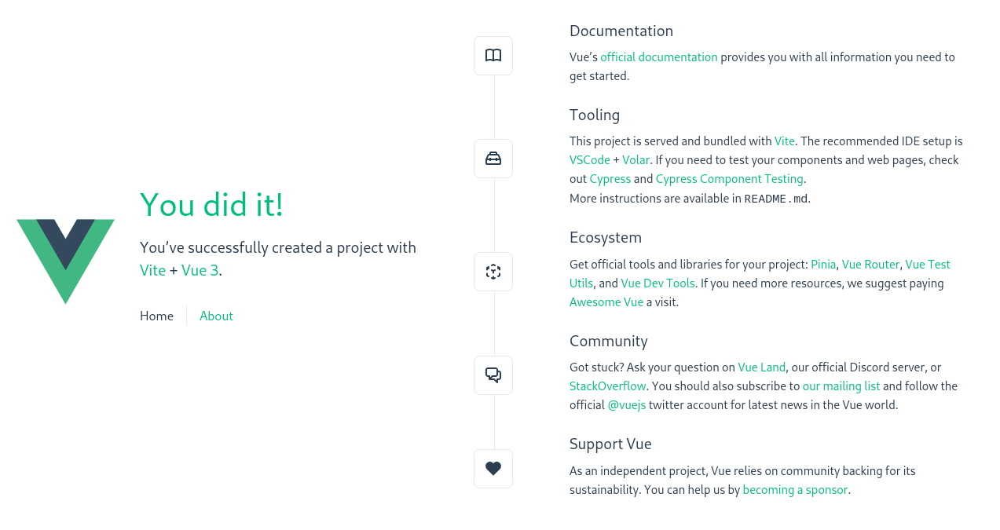

# Lesson 1 - Creating a Vue Application

> Prerequisites
>   - Familiarity with the command line
>   - Install Node.js version 16.0 or higher

In this section, we will introduce how to scaffold a Vue Single Page Application on your local machine. The created project will be using a build setup based on Vite and allow us to use Vue Single-File Components (SFCs).

Make sure you have an up-to-date version of Node.js installed, then run the following command in your command line:

```shell
npm init vue@latest
```

This command will install and execute create-vue, the official Vue project scaffolding tool. You will be presented with prompts for several optional features support.

We have selected the following options:

```
✔ Project name: … Vue-Car-Parking-App-Demo
✔ Package name: … vue-car-parking-app-demo
✔ Add TypeScript? … No
✔ Add JSX Support? … No
✔ Add Vue Router for Single Page Application development? … Yes
✔ Add Pinia for state management? … Yes
✔ Add Vitest for Unit Testing? … No
✔ Add an End-to-End Testing Solution? › No
✔ Add ESLint for code quality? … Yes
✔ Add Prettier for code formatting? … Yes

Scaffolding project in ./Vue-Car-Parking-App-Demo...
Done.
```

> Note that we chose to install Vue Router for routing and Pinia for the application's state management. These are important steps not to miss.

```
✔ Add Vue Router for Single Page Application development? … Yes
✔ Add Pinia for state management? … Yes
```

Once the project is created, follow the instructions to install dependencies and start the dev server:

```shell
cd Vue-Car-Parking-App-Demo
npm install
npm run dev
```

When the server starts you will be prompted that the server is ready and the URL to access it will be shown:

```

  VITE v4.0.4  ready in 207 ms

  ➜  Local:   http://localhost:5173/
  ➜  Network: use --host to expose
  ➜  press h to show help

```

Navigate to the URL and you should see the default template:

