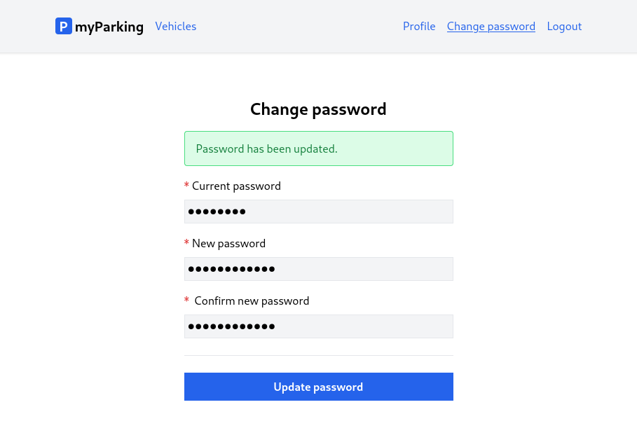

# Lesson 10 - Change password page

Now it is time to implement the change password feature for our logged-in users. This lesson is no different than the previous one in terms of complexity, actually a lot simpler since we won't be fetching anything from the server. Our change password form will look like this.



Before we go with implementation let's discuss a few things first. Why can't we have password fields on the same profile page? Well, some pages have that, but this also introduces new problems.

- The concept of leaving blank password fields to keep the same password sometimes is too complicated for the user.
- It can be understood that there is no password.
- It can be even more confusing if you have them displayed with meaningless asterisks.
- How do we display field labels? Are all three fields optional? If at least one of them is filled you need the other two filled.
- If all fields are required why do I need to change my password if the only thing I want to change is the name?
- Validation on the backend of submitted forms becomes more complex, and now has two responsibilities at once. One for account details, and another for changing the password.

There is no need to have password fields every time user wants to edit account details. Otherwise, it is inevitable that at some point the user gets the validation error message unnecessarily.

Having a separate form to change passwords resolves all the issues above and makes both end-users and developers happy. That being said let's implement the form.

1. Create a change password store `src/stores/changePassword.js`.

```js
import { reactive, ref } from "vue";
import { defineStore } from "pinia";

export const useChangePassword = defineStore("change-password", () => {
  const errors = reactive({});
  const status = ref("");
  const loading = ref(false);
  const form = reactive({
    current_password: "",
    password: "",
    password_confirmation: "",
  });

  function resetForm() {
    form.current_password = "";
    form.password = "";
    form.password_confirmation = "";

    errors.value = {};
    status.value = "";
  }

  async function updatePassword() {
    loading.value = true;
    errors.value = {};
    status.value = "";

    return window.axios
      .put("password", form)
      .then(() => {
        status.value = "Password has been updated.";
      })
      .catch((error) => {
        if (error.response.status === 422) {
          errors.value = error.response.data.errors;
        }
      })
      .finally(() => {
        form.current_password = "";
        form.password = "";
        form.password_confirmation = "";
        loading.value = false;
      });
  }

  return {
    form,
    loading,
    errors,
    resetForm,
    status,
    updatePassword,
  };
});
```

2. Create a new `src/views/Profile/ChangePassword.vue` component.

```vue
<script setup>
import { onBeforeUnmount } from "vue";
import { useChangePassword } from "@/stores/changePassword";

const store = useChangePassword();

onBeforeUnmount(store.resetForm);
</script>

<template>
  <form @submit.prevent="store.updatePassword">
    <div class="flex flex-col mx-auto md:w-96 w-full">
      <h1 class="text-2xl font-bold mb-4 text-center">Change password</h1>
      <div class="alert alert-success mb-4" v-show="store.status">
        {{ store.status }}
      </div>
      <div class="flex flex-col gap-2 mb-4">
        <label for="current_password" class="required">Current password</label>
        <input
          type="password"
          name="current_password"
          id="current_password"
          class="form-input"
          v-model="store.form.current_password"
          :disabled="store.loading"
        />
        <ValidationError :errors="store.errors" field="current_password" />
      </div>
      <div class="flex flex-col gap-2 mb-4">
        <label for="password" class="required">New password</label>
        <input
          type="password"
          name="password"
          id="password"
          class="form-input"
          v-model="store.form.password"
          :disabled="store.loading"
        />
        <ValidationError :errors="store.errors" field="password" />
      </div>
      <div class="flex flex-col gap-2">
        <label for="password_confirmation" class="required">
          Confirm new password
        </label>
        <input
          type="password"
          name="password_confirmation"
          id="password_confirmation"
          class="form-input"
          v-model="store.form.password_confirmation"
          :disabled="store.loading"
        />
      </div>

      <div class="border-t h-[1px] my-6"></div>

      <button type="submit" class="btn btn-primary" :disabled="store.loading">
        <IconSpinner class="animate-spin" v-show="store.loading" />
        Update password
      </button>
    </div>
  </form>
</template>
```

3. Register a new route with the newly created component in `src/router/index.js`.

```js
{
  path: "/profile/change-password",
  name: "profile.change-password",
  beforeEnter: auth,
  component: () => import("@/views/Profile/ChangePassword.vue"),
},
```

The entire content of the `src/router/index.js` file looks like this.

```js
import { createRouter, createWebHistory } from "vue-router";

function auth(to, from, next) {
  if (!localStorage.getItem("access_token")) {
    return next({ name: "login" });
  }

  next();
}

function guest(to, from, next) {
  if (localStorage.getItem("access_token")) {
    return next({ name: "vehicles.index" });
  }

  next();
}

const router = createRouter({
  history: createWebHistory(import.meta.env.BASE_URL),
  routes: [
    {
      path: "/",
      name: "home",
      component: import("@/views/HomeView.vue"),
    },
    {
      path: "/register",
      name: "register",
      beforeEnter: guest,
      component: () => import("@/views/Auth/RegisterView.vue"),
    },
    {
      path: "/login",
      name: "login",
      beforeEnter: guest,
      component: () => import("@/views/Auth/LoginView.vue"),
    },
    {
      path: "/profile",
      name: "profile.edit",
      beforeEnter: auth,
      component: () => import("@/views/Profile/EditView.vue"),
    },
    {
      path: "/profile/change-password",
      name: "profile.change-password",
      beforeEnter: auth,
      component: () => import("@/views/Profile/ChangePassword.vue"),
    },
    {
      path: "/vehicles",
      name: "vehicles.index",
      beforeEnter: auth,
      component: () => import("@/views/Vehicles/IndexView.vue"),
    },
  ],
});

export default router;
```

4. Finally add a link to view in a top bar navigation in `src/App.vue`.

```vue
<RouterLink
  class="router-link"
  :to="{ name: 'profile.change-password' }"
>
  Change password
</RouterLink>
```

Our `src/App.vue` component should be like that now.

```vue
<script setup>
import { RouterLink, RouterView } from "vue-router";
import { useAuth } from "@/stores/auth";

const auth = useAuth();
</script>

<template>
  <header class="py-6 bg-gray-100 shadow">
    <div class="container md:px-2 px-4 mx-auto">
      <nav class="flex gap-4 justify-between">
        <div class="flex gap-4 items-center">
          <h2 class="text-xl font-bold">
            <div
              class="inline-flex items-center justify-center bg-blue-600 w-6 h-6 text-center text-white rounded"
            >
              P
            </div>
            myParking
          </h2>

          <template v-if="auth.check">
            <RouterLink class="router-link" :to="{ name: 'vehicles.index' }">
              Vehicles
            </RouterLink>
          </template>
          <template v-else>
            <RouterLink class="router-link" :to="{ name: 'home' }">
              Home
            </RouterLink>
          </template>
        </div>
        <div class="flex gap-4 items-center">
          <template v-if="auth.check">
            <RouterLink class="router-link" :to="{ name: 'profile.edit' }">
              Profile
            </RouterLink>
            <RouterLink
              class="router-link"
              :to="{ name: 'profile.change-password' }"
            >
              Change password
            </RouterLink>
            <button @click="auth.logout" class="router-link">Logout</button>
          </template>
          <template v-else>
            <RouterLink class="router-link" :to="{ name: 'login' }">
              Login
            </RouterLink>
            <RouterLink class="router-link" :to="{ name: 'register' }">
              Register
            </RouterLink>
          </template>
        </div>
      </nav>
    </div>
  </header>

  <div class="container md:px-2 px-4 pt-8 md:pt-16 mx-auto">
    <RouterView />
  </div>
</template>
```