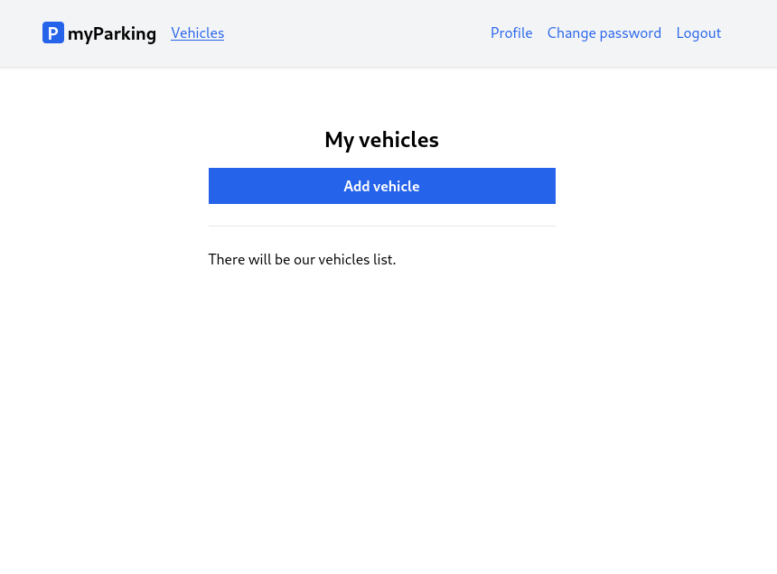
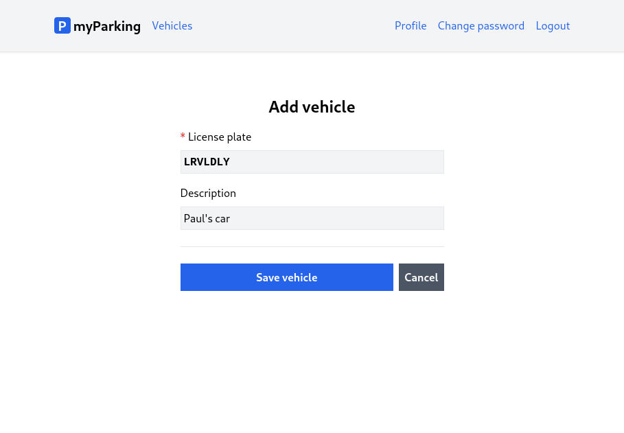
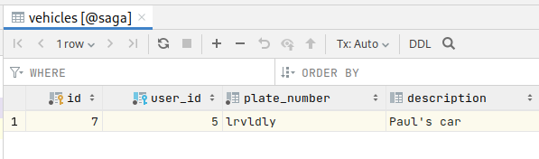

# Lesson 11 - Create a vehicle

Firstly for a user to be able to order parking in a particular zone they must be able to add their owned vehicles. In this lesson, we will start to implement our first CRUD. When a user is registered or logged in he will be redirected to the `vehicles.index` page. Yet we have only a placeholder for the vehicles list because we do not have any vehicles stored and need to create some first.



And the form to add a vehicle will look like this. After pressing the `Save vehicle` form is submitted to the server and then redirected back to the list. Pressing the `Cancel` redirect will immediately disregard the form without submitting it.



1. Create a new `src/stores/vehicle.js` store with the following content.

```js
import { reactive, ref } from "vue";
import { defineStore } from "pinia";
import { useRouter } from "vue-router";

export const useVehicle = defineStore("vehicle", () => {
  const router = useRouter();
  const errors = reactive({});
  const loading = ref(false);
  const form = reactive({
    plate_number: "",
    description: "",
  });

  function resetForm() {
    form.plate_number = "";
    form.description = "";

    errors.value = {};
  }

  function storeVehicle() {
    if (loading.value) return;

    loading.value = true;
    errors.value = {};

    window.axios
      .post("vehicles", form)
      .then(() => {
        router.push({ name: "vehicles.index" });
      })
      .catch((error) => {
        if (error.response.status === 422) {
          errors.value = error.response.data.errors;
        }
      })
      .finally(() => (loading.value = false));
  }

  return { form, errors, loading, resetForm, storeVehicle };
});
```

Store contents are very similar to the other ones, except we have imported the `useRouter()` function to be able to navigate to the index page after successfully saving the form.

```js
import { useRouter } from "vue-router";

// ...

const router = useRouter();

// ...

function storeVehicle() {
  // ...

  window.axios
    .post("vehicles", form)
    .then(() => {
      router.push({ name: "vehicles.index" });
    })
  //...
```

2. Create a new `src/views/Vehicles/CreateView.vue` component.

```vue
<script setup>
import { onBeforeUnmount } from "vue";
import { useVehicle } from "@/stores/vehicle";

const store = useVehicle();

onBeforeUnmount(store.resetForm);
</script>

<template>
  <form @submit.prevent="store.storeVehicle" novalidate>
    <div class="flex flex-col mx-auto md:w-96 w-full">
      <h1 class="text-2xl font-bold mb-4 text-center">Add vehicle</h1>
      <div class="flex flex-col gap-2 mb-4">
        <label for="plate_number" class="required">License plate</label>
        <input
          v-model="store.form.plate_number"
          id="plate_number"
          name="plate_number"
          type="text"
          class="form-input plate"
          :disabled="store.loading"
        />
        <ValidationError :errors="store.errors" field="plate_number" />
      </div>
      <div class="flex flex-col gap-2">
        <label for="description">Description</label>
        <input
          v-model="store.form.description"
          id="description"
          name="description"
          type="text"
          class="form-input"
          placeholder="My Ferrari, Big truck, Rental"
          :disabled="store.loading"
        />
        <ValidationError :errors="store.errors" field="description" />
      </div>

      <div class="border-t h-[1px] my-6"></div>

      <div class="flex gap-2">
        <button
          type="submit"
          class="btn btn-primary w-full"
          :disabled="store.loading"
        >
          <IconSpinner class="animate-spin" v-show="store.loading" />
          Save vehicle
        </button>
        <RouterLink :to="{ name: 'vehicles.index' }" class="btn btn-secondary">
          Cancel
        </RouterLink>
      </div>
    </div>
  </form>
</template>
```

To display the license plate in monospaced bold uppercase font, we added a separate CSS class named `plate`. It will be used throughout the demo app.

For the cancel button, we wrap both buttons with `<div class="flex gap-2">` to let flexbox do all the positioning and spacing for us. The cancel button itself is a `<RouterLink />` component from Vue Router. We already used that component for top bar navigation except it has `btn btn-secondary` classes. And for the button, the `w-full` class was added to be as wide as much space we have.

```vue
<div class="flex gap-2">
  <button
    type="submit"
    class="btn btn-primary w-full"
    :disabled="store.loading"
  >
    <IconSpinner class="animate-spin" v-show="store.loading" />
    Save vehicle
  </button>
  <RouterLink :to="{ name: 'vehicles.index' }" class="btn btn-secondary">
    Cancel
  </RouterLink>
</div>
```

3. Now let's define those `plate` and `btn-secondary` classes in the `src/assets/main.css` file.

```
.btn-secondary {
    @apply text-white bg-gray-600 hover:bg-gray-500;
}

.plate {
    @apply font-mono font-bold uppercase;
}
```

Full contents of `src/assets/main.css` now should look like this.

```
@tailwind base;
@tailwind components;
@tailwind utilities;

@layer components {
    label.required {
        @apply before:text-red-600 before:content-['*'] before:mr-1;
    }

    .form-input {
        @apply p-1 border bg-gray-100 disabled:opacity-50;
    }

    .btn {
        @apply inline-flex items-center gap-2 justify-center p-2 font-bold relative disabled:!opacity-50 disabled:!cursor-progress;
    }

    .btn-primary {
        @apply text-white bg-blue-600 hover:bg-blue-500;
    }

    .btn-secondary {
        @apply text-white bg-gray-600 hover:bg-gray-500;
    }

    .router-link {
        @apply text-blue-600 hover:underline;
    }

    .router-link-active.router-link {
        @apply underline;
    }

    .alert {
        @apply border px-4 py-3 rounded relative;
    }

    .alert-success {
        @apply text-green-700 bg-green-100 border-green-400
    }

    .plate {
        @apply font-mono font-bold uppercase;
    }
}
```

4. Register the `CreateView.vue` component in the routes file `src/router/index.js`.

```js
{
  path: "/vehicles/create",
  name: "vehicles.create",
  beforeEnter: auth,
  component: () => import("@/views/Vehicles/CreateView.vue"),
},
```

Route definitions `src/router/index.js` have the following content.

```js
import { createRouter, createWebHistory } from "vue-router";

function auth(to, from, next) {
  if (!localStorage.getItem("access_token")) {
    return next({ name: "login" });
  }

  next();
}

function guest(to, from, next) {
  if (localStorage.getItem("access_token")) {
    return next({ name: "vehicles.index" });
  }

  next();
}

const router = createRouter({
  history: createWebHistory(import.meta.env.BASE_URL),
  routes: [
    {
      path: "/",
      name: "home",
      component: import("@/views/HomeView.vue"),
    },
    {
      path: "/register",
      name: "register",
      beforeEnter: guest,
      component: () => import("@/views/Auth/RegisterView.vue"),
    },
    {
      path: "/login",
      name: "login",
      beforeEnter: guest,
      component: () => import("@/views/Auth/LoginView.vue"),
    },
    {
      path: "/profile",
      name: "profile.edit",
      beforeEnter: auth,
      component: () => import("@/views/Profile/EditView.vue"),
    },
    {
      path: "/profile/change-password",
      name: "profile.change-password",
      beforeEnter: auth,
      component: () => import("@/views/Profile/ChangePassword.vue"),
    },
    {
      path: "/vehicles",
      name: "vehicles.index",
      beforeEnter: auth,
      component: () => import("@/views/Vehicles/IndexView.vue"),
    },
    {
      path: "/vehicles/create",
      name: "vehicles.create",
      beforeEnter: auth,
      component: () => import("@/views/Vehicles/CreateView.vue"),
    },
  ],
});

export default router;
```

5. Now we can update the `src/views/Vehicles/IndexView.vue` component to display the button to the create form.

```vue
<template>
  <div class="flex flex-col mx-auto md:w-96 w-full">
    <h1 class="text-2xl font-bold mb-4 text-center">My vehicles</h1>

    <RouterLink
      :to="{ name: 'vehicles.create' }"
      class="btn btn-primary w-full"
    >
      Add vehicle
    </RouterLink>

    <div class="border-t h-[1px] my-6"></div>

    <div>There will be our vehicles list.</div>
  </div>
</template>
```

When you save the vehicle you will be redirected to the index page and no list is displayed yet. On the database `vehicles` table you should see a new record.



Let's move forward to the next lesson, and display the vehicles list on the client.