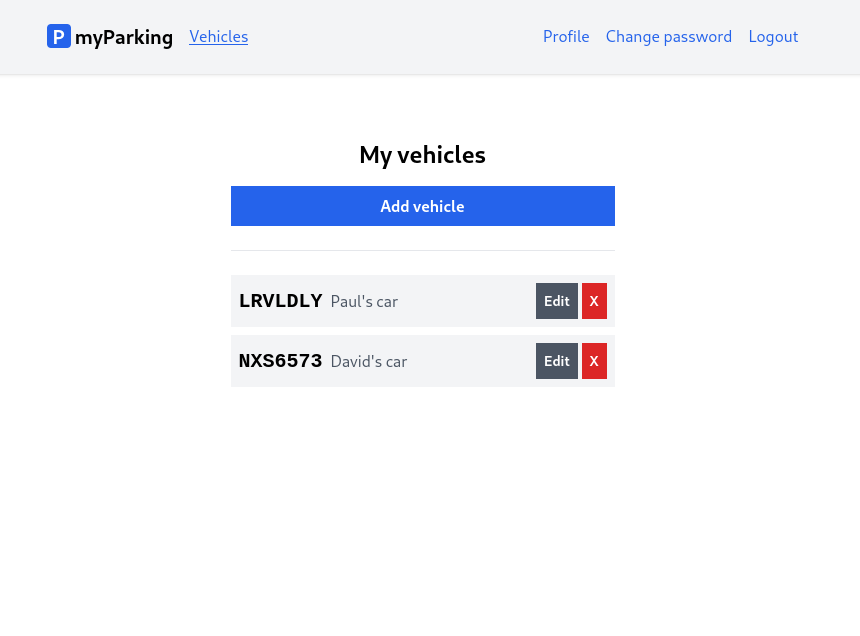

# Lesson 12 - Vehicles list

After adding a new vehicle to the user's account, the following list of users' cars should be our goal for this lesson.



1. First we want to extend the `src/stores/vehicle.js` store.

```js
// ...

const vehicles = ref([]);

// ...

function getVehicles() {
  return window.axios
    .get("vehicles")
    .then((response) => (vehicles.value = response.data.data));
}

// ...

return {
  form,
  errors,
  loading,
  resetForm,
  storeVehicle,
  vehicles,
  getVehicles,
};
```

A new variable was created `const vehicles = ref([])`. It will hold the vehicles list fetched from API by the `getVehicles()` method. Both `vehicles` and `getVehicles()` are returned from the store function to make them available in the component.

The extended store file has the following content.

```js
import { reactive, ref } from "vue";
import { defineStore } from "pinia";
import { useRouter } from "vue-router";

export const useVehicle = defineStore("vehicle", () => {
  const router = useRouter();
  const errors = reactive({});
  const loading = ref(false);
  const vehicles = ref([]);
  const form = reactive({
    plate_number: "",
    description: "",
  });

  function resetForm() {
    form.plate_number = "";
    form.description = "";

    errors.value = {};
  }

  function getVehicles() {
    return window.axios
      .get("vehicles")
      .then((response) => (vehicles.value = response.data.data));
  }

  function storeVehicle() {
    if (loading.value) return;

    loading.value = true;
    errors.value = {};

    window.axios
      .post("vehicles", form)
      .then(() => {
        router.push({ name: "vehicles.index" });
      })
      .catch((error) => {
        if (error.response.status === 422) {
          errors.value = error.response.data.errors;
        }
      })
      .finally(() => (loading.value = false));
  }

  return {
    form,
    errors,
    loading,
    resetForm,
    storeVehicle,
    vehicles,
    getVehicles,
  };
});
```

2. Update the `src/views/Vehicles/IndexView.vue` component.

```vue
<script setup>
import { onMounted } from "vue";
import { useVehicle } from "@/stores/vehicle";

const store = useVehicle();

onMounted(store.getVehicles);
</script>

<template>
  <div class="flex flex-col mx-auto md:w-96 w-full">
    <h1 class="text-2xl font-bold mb-4 text-center">My vehicles</h1>

    <RouterLink
      :to="{ name: 'vehicles.create' }"
      class="btn btn-primary w-full"
    >
      Add vehicle
    </RouterLink>

    <div class="border-t h-[1px] my-6"></div>

    <div class="flex flex-col gap-2">
      <div
        v-for="vehicle in store.vehicles"
        :key="vehicle.id"
        class="flex bg-gray-100 w-full p-2 justify-between"
      >
        <div class="flex items-center overflow-hidden w-full">
          <div class="text-xl plate">
            {{ vehicle.plate_number }}
          </div>
          <div class="font-normal text-gray-600 pl-2 grow truncate">
            {{ vehicle.description }}
          </div>
        </div>
        <div class="flex gap-1">
          <button type="button" class="btn btn-secondary text-sm">Edit</button>
          <button
            type="button"
            class="btn text-white bg-red-600 hover:bg-red-500 text-sm"
          >
            X
          </button>
        </div>
      </div>
    </div>
  </div>
</template>
```

## Text interpolation

The most basic form of data binding is text interpolation using the "Mustache" syntax (double curly braces):

```vue
<div class="text-xl plate">
  {{ vehicle.plate_number }}
</div>
<div class="font-normal text-gray-600 pl-2 grow truncate">
  {{ vehicle.description }}
</div>
```

The mustache tag will be replaced with the value of the `vehicle.plate_number` property from the vehicle object.

## List rendering

We can use the `v-for` directive to render a list of items based on an array. The `v-for` directive requires a special syntax in the form of `item in items`, where `items` is the source data array and `item` is an **alias** for the array element being iterated on:

```vue
<div
  v-for="vehicle in store.vehicles"
  :key="vehicle.id"
  class="flex bg-gray-100 w-full p-2 justify-between"
>
```

When Vue is updating a list of elements rendered with `v-for`, by default it uses an "in-place patch" strategy. If the order of the data items has changed, instead of moving the DOM elements to match the order of the items, Vue will patch each element in place and make sure it reflects what should be rendered at that particular index.

To give Vue a hint so that it can track each node's identity, and thus reuse and reorder existing elements, you need to provide a unique `key` attribute for each item. Since every vehicle returned from API contains a unique id we can provide a `key` value using `vehicle.id`.

---

Each vehicle row has edit and delete buttons to be implemented:

```vue
<div class="flex gap-1">
  <button type="button" class="btn btn-secondary text-sm">Edit</button>
  <button
    type="button"
    class="btn text-white bg-red-600 hover:bg-red-500 text-sm"
  >
    X
  </button>
</div>
```