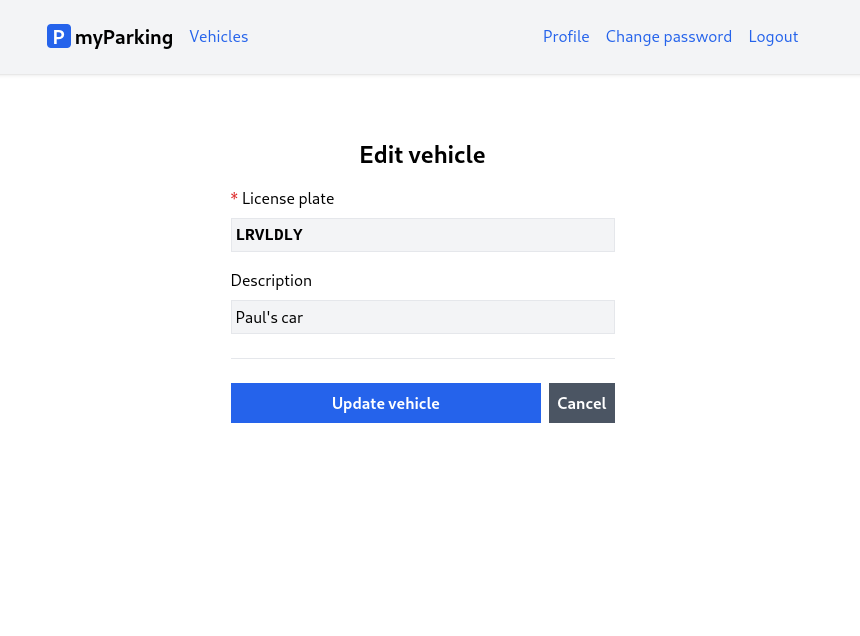

# Lesson 13 - Edit vehicle

In this lesson, we will add an edit form to vehicles CRUD which is almost identical to create, except we are going to have a different URL `/vehicles/:id/edit`. By URL parameter `:id` data of specific vehicles will be fetched from API.



1. Extend vehicle store `src/stores/vehicle.js`.

```js
function updateVehicle(vehicle) {
  if (loading.value) return;

  loading.value = true;
  errors.value = {};

  window.axios
    .put(`vehicles/${vehicle.id}`, form)
    .then(() => {
      router.push({ name: "vehicles.index" });
    })
    .catch((error) => {
      if (error.response.status === 422) {
        errors.value = error.response.data.errors;
      }
    })
    .finally(() => (loading.value = false));
}

function getVehicle(vehicle) {
  window.axios.get(`vehicles/${vehicle.id}`).then((response) => {
    form.plate_number = response.data.data.plate_number;
    form.description = response.data.data.description;
  });
}
```

Here we have two more methods in the store.

- `updateVehicle()` - will be used when we submit the form and like the method from create form, it will redirect us to the index view if the request was successful.
- `getVehicle()` - fetches specific vehicle data and updates form fields to edit.

Both methods accept the vehicle parameter which is a vehicle object `{ id: 312 }`. It may contain more keys but they are not necessary and not used for these methods.

2. Create a new component `src/views/Vehicles/EditView.vue`.

```vue
<script setup>
import { watchEffect, onBeforeUnmount } from "vue";
import { useVehicle } from "@/stores/vehicle";
import { useRoute } from "vue-router";

const store = useVehicle();
const route = useRoute();

onBeforeUnmount(store.resetForm);

watchEffect(async () => {
  store.getVehicle({ id: route.params.id });
});
</script>

<template>
  <form
    @submit.prevent="store.updateVehicle({ id: route.params.id })"
    novalidate
  >
    <div class="flex flex-col mx-auto md:w-96 w-full">
      <h1 class="text-2xl font-bold mb-4 text-center">Edit vehicle</h1>
      <div class="flex flex-col gap-2 mb-4">
        <label for="plate_number" class="required">License plate</label>
        <input
          v-model="store.form.plate_number"
          id="plate_number"
          name="plate_number"
          type="text"
          class="form-input plate"
          :disabled="store.loading"
        />
        <ValidationError :errors="store.errors" field="plate_number" />
      </div>
      <div class="flex flex-col gap-2">
        <label for="description">Description</label>
        <input
          v-model="store.form.description"
          id="description"
          name="description"
          type="text"
          class="form-input"
          placeholder="My Ferrari, Big truck, Rental"
          :disabled="store.loading"
        />
        <ValidationError :errors="store.errors" field="description" />
      </div>

      <div class="border-t h-[1px] my-6"></div>

      <div class="flex gap-2">
        <button
          type="submit"
          class="btn btn-primary w-full"
          :disabled="store.loading"
        >
          <IconSpinner class="animate-spin" v-show="store.loading" />
          Update vehicle
        </button>
        <RouterLink :to="{ name: 'vehicles.index' }" class="btn btn-secondary">
          Cancel
        </RouterLink>
      </div>
    </div>
  </form>
</template>
```

3. Register route for the newly created component in `src/router/index.js`.

```js
{
  path: "/vehicles/:id/edit",
  name: "vehicles.edit",
  beforeEnter: auth,
  component: () => import("@/views/Vehicles/EditView.vue"),
},
```

Now let's go through new things.

### Routing

Very often we will need to map routes with the given pattern to the same component. We have the `src/views/Vehicles/EditView.vue` component which should be rendered for all vehicles but with different vehicle IDs. In Vue Router we can use a dynamic segment in the path to achieving this. We call that a param.

Now URLs like `/vehicles/1/edit` and `/vehicles/3/edit` will both map to the same route.

A param is denoted by a colon `:`. When a route is matched, the value of its params will be exposed as `this.$route.params` in every component.

In our demo, we use Composition API instead of Options API. So route params in our component can be accessed like this:

```js
import { useRoute } from "vue-router";

const route = useRoute();

route.params.id
```

We need this parameter for the `getVehicle()` method to fetch vehicle data in the `Vehicles/EditView.vue` component. When a component loads we could just call:

```js
store.getVehicle({ id: route.params.id })
```

### Watchers

But what if you later decide to change the route param programmatically? Then your URL will be updated, but the data in the form not. To avoid that watchers come in handy.

However, there are cases where we need to perform "side effects" in reaction to state changes - in our case when `route.param.id` changes, we need to fetch vehicle data based on that id.

With Composition API, we can use the [`watch` function](https://vuejs.org/api/reactivity-core.html#watch) to trigger a callback whenever a `route.param.id` changes.

```js
import { watch } from "vue";

watch(
  () => route.params.id,
  async (current) => {
    store.getVehicle({ id: current });
  },
  { immediate: true }
);
```

`watch`'s first argument is a getter function that returns a property we want to track for changes as source value. The second argument is our "side effect" what should happen when that change occurs.

`watch` is lazy by default: The callback won't be called until the watched source has changed. But in some cases we may want the same callback logic to be run eagerly - for example, we may want to fetch some initial data, and then re-fetch the data whenever the relevant state changes.

We can force a watcher's callback to be executed immediately by passing the `immediate: true` option.

It is common for the watcher callback to use the same reactive state as the source. This means we listen for `route.params.id` and use the same value in our "side effect".

This can be simplified with [`watchEffect()`](https://vuejs.org/api/reactivity-core.html#watcheffect). `watchEffect()` allows us to track the callback's reactive dependencies automatically. The watcher above can be rewritten as:

```js
import { watchEffect } from "vue";

watchEffect(async () => {
  store.getVehicle({ id: route.params.id });
});
```

Here, the callback will run immediately, there's no need to specify `immediate: true`. During its execution, it will automatically track the `route.params.id` value as a dependency. Whenever the `route.params.id` value changes, the callback will be run again. With `watchEffect()` we no longer need to pass `route.params.id` explicitly as the source value.

### Form submit

To submit the form we call `store.updateVehicle()` and pass `{ id: route.params.id }`. We use the same route parameter when we call `getVehicle()`.

```vue
<form
  @submit.prevent="store.updateVehicle({ id: route.params.id })"
  novalidate
>
```

4. Finally let's update the vehicles list component `src/views/Vehicles/IndexView.vue`.

Replace gimmick edit button from:

```vue
<button type="button" class="btn btn-secondary text-sm">Edit</button>
```

to:

```vue
<RouterLink
  :to="{ name: 'vehicles.edit', params: { id: vehicle.id } }"
  class="btn btn-secondary text-sm"
>
  Edit
</RouterLink>
```

As we defined our edit view route `/vehicles/:id/edit` it now needs the `id` parameter. It can be passed by adding the `params` key. Since the button is in the `v-for` loop and the id of every vehicle is known full `:to` route object looks like this `{ name: 'vehicles.edit', params: { id: vehicle.id } }`.