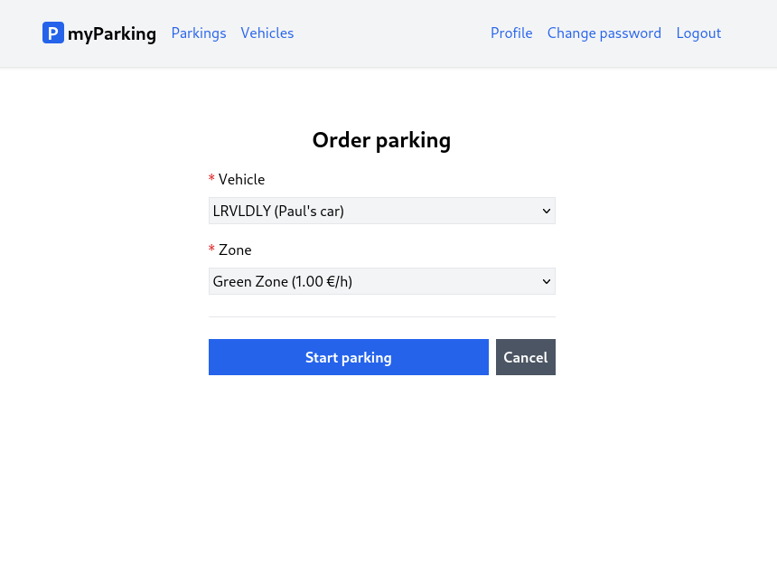
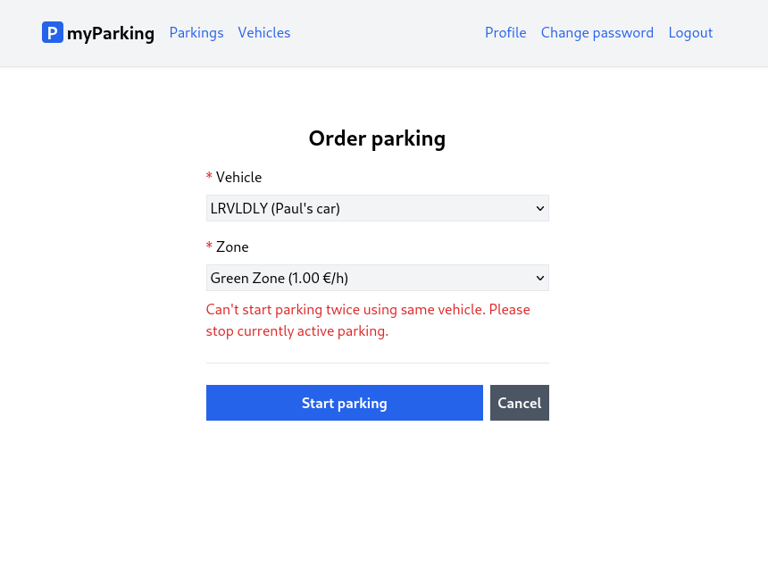

# Lesson 15 - Order new parking page

Time to create a form to allow users to start parking by choosing one of the vehicles they added to their account and selecting the zone.



1. Create a new store `src/stores/zone.js`.

```js
import { ref } from "vue";
import { defineStore } from "pinia";

export const useZone = defineStore("zone", () => {
  const zones = ref([]);

  function getZones() {
    return window.axios
      .get("zones")
      .then((response) => (zones.value = response.data.data));
  }

  return { getZones, zones };
});
```

Here we have the `getZones()` method to get information from API about parking zones. This data will be accessible via the `zones` variable.

2. Create another store `src/stores/parking.js`.

```js
import { reactive, ref } from "vue";
import { defineStore } from "pinia";
import { useRouter } from "vue-router";

export const useParking = defineStore("parking", () => {
  const router = useRouter();
  const errors = reactive({});
  const loading = ref(false);
  const form = reactive({
    vehicle_id: null,
    zone_id: null,
  });

  function resetForm() {
    form.vehicle_id = null;
    form.zone_id = null;

    errors.value = {};
  }

  function startParking() {
    if (loading.value) return;

    loading.value = true;
    errors.value = {};

    return window.axios
      .post("parkings/start", form)
      .then(() => {
        router.push({ name: "parkings.active" });
      })
      .catch((error) => {
        if (error.response.status === 422) {
          errors.value = error.response.data.errors;
        }
      })
      .finally(() => (loading.value = false));
  }

  return { form, errors, loading, resetForm, startParking };
});
```

This is pretty much much similar boilerplate for our stores. Another method to call API `startParkin()`. And two form fields `vehicle_id` and `zone_id` will be submitted to the backend.

3. This is where it gets more interesting. Create a new component `src/views/Parkings/OrderParking.vue`.

```vue
<script setup>
import { onBeforeUnmount } from "vue";
import { useVehicle } from "@/stores/vehicle";
import { useZone } from "@/stores/zone";
import { useParking } from "@/stores/parking";

const vehicleStore = useVehicle();
const zoneStore = useZone();
const parkingStore = useParking();

vehicleStore.getVehicles().then((response) => {
  if (response.length > 0) {
    parkingStore.form.vehicle_id = response[0].id;
  }
});

zoneStore.getZones().then((response) => {
  if (response.length > 0) {
    parkingStore.form.zone_id = response[0].id;
  }
});

onBeforeUnmount(parkingStore.resetForm);
</script>

<template>
  <form @submit.prevent="parkingStore.startParking" novalidate>
    <div class="flex flex-col mx-auto md:w-96 w-full">
      <h1 class="text-2xl font-bold mb-4 text-center">Order parking</h1>

      <div class="flex flex-col gap-2 mb-4">
        <label for="vehicle_id" class="required">Vehicle</label>
        <select
          v-model="parkingStore.form.vehicle_id"
          name="vehicle_id"
          id="vehicle_id"
          class="form-input"
          :disabled="parkingStore.loading"
        >
          <option
            v-for="vehicle in vehicleStore.vehicles"
            :value="vehicle.id"
            :key="vehicle.id"
          >
            {{ vehicle.plate_number.toUpperCase() }}
            <span v-if="vehicle.description">({{ vehicle.description }})</span>
          </option>
        </select>
        <ValidationError :errors="parkingStore.errors" field="vehicle_id" />
      </div>

      <div class="flex flex-col gap-2">
        <label for="zone_id" class="required">Zone</label>
        <select
          v-model="parkingStore.form.zone_id"
          name="zone_id"
          id="zone_id"
          class="form-input"
          :disabled="parkingStore.loading"
        >
          <option
            v-for="zone in zoneStore.zones"
            :value="zone.id"
            :key="zone.id"
          >
            {{ zone.name }}
            ({{ (zone.price_per_hour / 100).toFixed(2) }} &euro;/h)
          </option>
        </select>
        <ValidationError :errors="parkingStore.errors" field="zone_id" />
        <ValidationError :errors="parkingStore.errors" field="general" />
      </div>

      <div class="border-t h-[1px] my-6"></div>

      <div class="flex gap-2">
        <button
          type="submit"
          class="btn btn-primary w-full"
          :disabled="parkingStore.loading"
        >
          <IconSpinner class="animate-spin" v-show="parkingStore.loading" />
          Start parking
        </button>
        <RouterLink :to="{ name: 'parkings.active' }" v-slot="{ navigate }">
          <button
            @click="navigate"
            :disabled="parkingStore.loading"
            class="btn btn-secondary"
          >
            Cancel
          </button>
        </RouterLink>
      </div>
    </div>
  </form>
</template>
```

We have all three stores imported.

```js
const vehicleStore = useVehicle();
const zoneStore = useZone();
const parkingStore = useParking();
```

`vehicleStore` will be used to get all the vehicles user owns. Notice we didn't implement anything related to vehicles. The whole reason to separate everything using Composition API was to reuse that logic later in future components.

`zoneStore` will provide us with data about parking zones.

`parkingStore` has an implementation of our form logic to start parking.

We also have a new form field, select dropdown, to simplify it has the following structure:

```vue
<select
  v-model="parkingStore.form.vehicle_id"
>
  <option
    v-for="vehicle in vehicleStore.vehicles"
    :value="vehicle.id"
    :key="vehicle.id"
  >
    {{ vehicle.plate_number }}
  </option>
</select>
```

It has the same `v-model` binding as the `<input>` field. The value assigned to `parkingStore.form.vehicle_id` will be the one we select the `<option>` from `:value` attribute and it is `vehicle.id`.

To display all options with vehicles available we iterate them using `v-for="vehicle in vehicleStore.vehicles"` as we did in the vehicles index view. Along with the `v-for` directive we need to define the `:key` attribute which is required for Vue to internally keep track of nodes.

When we load the form none of our options will be selected by default and the default attribute `selected` doesn't work there.

`v-model` will ignore the initial `selected` attributes found on any form elements. It will always treat the current bound JavaScript state as the source of truth. We should declare the initial value on the JavaScript side.

This is done when our component loads, we call the `getVehicles()` method from `vehicleStore`. When we get the response we assign the first vehicle id `response[0].id`  from the list to `parkingStore.form.vehicle_id`. This is the same value bound to our `<select>` element `v-model="parkingStore.form.vehicle_id"`.

```js
vehicleStore.getVehicles().then((response) => {
  if (response.length > 0) {
    parkingStore.form.vehicle_id = response[0].id;
  }
});
```

The complete same logic applies to `zone_id`.

On the bottom of the form we have an additional `<ValidationError />` component with a field named `general`.

```vue
<ValidationError :errors="parkingStore.errors" field="zone_id" />
<ValidationError :errors="parkingStore.errors" field="general" />
```

`general` errors are displayed when API returns errors not related to fields. For example, if you try to start parking while having one active on your vehicle.



It is important to note that the `<option>` element is pretty limited to styling, this is a reason we didn't apply any CSS classes.

```vue
<option
  v-for="vehicle in vehicleStore.vehicles"
  :value="vehicle.id"
  :key="vehicle.id"
>
  {{ vehicle.plate_number.toUpperCase() }}
  <span v-if="vehicle.description">({{ vehicle.description }})</span>
</option>
```

To display plate numbers in uppercase we can use JavaScript's string method `toUpperCase()`. For description, if `vehicle.description` enumerates to true, we display that description.

Similarly, we format zone options.

```vue
<option
  v-for="zone in zoneStore.zones"
  :value="zone.id"
  :key="zone.id"
>
  {{ zone.name }}
  ({{ (zone.price_per_hour / 100).toFixed(2) }} &euro;/h)
</option>
```

`zone.price_per_hour` is returned in cents from the API. By dividing it by 100 it would give us a result of `1`. To always display decimal points we need to use the `toFixed()` function which is native JavaScript's method for integers and floats. How many decimal points to display is specified by a parameter, in our case, it is `toFixed(2)`. For the euro currency sign in HTML, there is a `&euro;` code.

`<RouterLink />` by default is displayed as an anchor tag `<a href=...>`. But when our form is being processed we change it to a loading state, so the user wouldn't end up with the situation when he submits the form, and later decides to cancel it while it is being processed and parking would still be started despite the user canceled it on the client. The anchor tag doesn't support the `disabled` attribute.

What can we do in this situation? We can add a button as a child element of the `<RouterLink />` component.

```vue
<RouterLink :to="{ name: 'parkings.active' }" v-slot="{ navigate }">
  <button
    @click="navigate"
    :disabled="parkingStore.loading"
    class="btn btn-secondary"
  >
    Cancel
  </button>
</RouterLink>
```

But what action this button should invoke when we click it?

We can expose the `navigate` function from the `<RouterLink />` component by adding `v-slot="{ navigate }"`, and bind that `navigate()` function on the button's `click` event.

4. Create a new `src/views/Parkings/ActiveParkings.vue` component. It will be our index view of parking to display currently active parking.

```vue
<template>
  <div class="flex flex-col mx-auto md:w-96 w-full">
    <h1 class="text-2xl font-bold mb-4 text-center">Active parkings</h1>

    <RouterLink
      :to="{ name: 'parkings.create' }"
      class="btn btn-primary w-full"
    >
      Order parking
    </RouterLink>

    <div class="border-t h-[1px] my-6"></div>

    <div>[active parkings list]</div>
  </div>
</template>
```

For now, it will have only a button to order a parking view and later we will implement an active parking list.

5. Now register our new components in a router `src/router/index.js`.

```js
{
  path: "/parkings/active",
  name: "parkings.active",
  beforeEnter: auth,
  component: () => import("@/views/Parkings/ActiveParkings.vue"),
},
{
  path: "/parkings/new",
  name: "parkings.create",
  beforeEnter: auth,
  component: () => import("@/views/Parkings/OrderParking.vue"),
},
```

6. And add navigation for Parkings in the top bar in `src/App.vue`.

```vue
<RouterLink class="router-link" :to="{ name: 'parkings.active' }">
  Parkings
</RouterLink>
```

Full `src/App.vue` file would like that now:

```vue
<script setup>
import { RouterLink, RouterView } from "vue-router";
import { useAuth } from "@/stores/auth";

const auth = useAuth();
</script>

<template>
  <header class="py-6 bg-gray-100 shadow">
    <div class="container md:px-2 px-4 mx-auto">
      <nav class="flex gap-4 justify-between">
        <div class="flex gap-4 items-center">
          <h2 class="text-xl font-bold">
            <div
              class="inline-flex items-center justify-center bg-blue-600 w-6 h-6 text-center text-white rounded"
            >
              P
            </div>
            myParking
          </h2>

          <template v-if="auth.check">
            <RouterLink class="router-link" :to="{ name: 'parkings.active' }">
              Parkings
            </RouterLink>
            <RouterLink class="router-link" :to="{ name: 'vehicles.index' }">
              Vehicles
            </RouterLink>
          </template>
          <template v-else>
            <RouterLink class="router-link" :to="{ name: 'home' }">
              Home
            </RouterLink>
          </template>
        </div>
        <div class="flex gap-4 items-center">
          <template v-if="auth.check">
            <RouterLink class="router-link" :to="{ name: 'profile.edit' }">
              Profile
            </RouterLink>
            <RouterLink
              class="router-link"
              :to="{ name: 'profile.change-password' }"
            >
              Change password
            </RouterLink>
            <button @click="auth.logout" class="router-link">Logout</button>
          </template>
          <template v-else>
            <RouterLink class="router-link" :to="{ name: 'login' }">
              Login
            </RouterLink>
            <RouterLink class="router-link" :to="{ name: 'register' }">
              Register
            </RouterLink>
          </template>
        </div>
      </nav>
    </div>
  </header>

  <div class="container md:px-2 px-4 pt-8 md:pt-16 mx-auto">
    <RouterView />
  </div>
</template>
```

And now we can select a vehicle, and zone, and start parking.