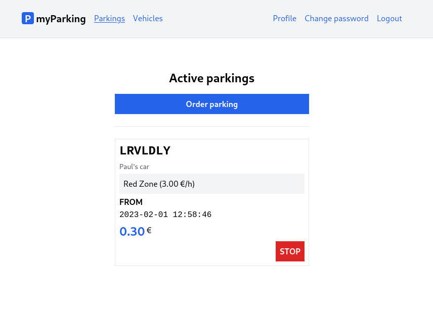

# Lesson 16 - View active parkings list and stop parking

In this lesson we will display active parkings list with a stop button to end parking.



1. Let's add two more methods into `src/stores/parking.js`.

```js
const parkings = ref([]);

function getActiveParkings() {
  return window.axios.get("parkings").then((response) => {
    parkings.value = response.data.data;
  });
}

function stopParking(parking) {
  window.axios.put(`parkings/${parking.id}`).then(getActiveParkings);
}

return {
  // ...
  parkings,
  getActiveParkings,
  stopParking,
};
```

`getActiveParkings()` will get currently active parkings. `stopParking()` will accept `parking` as parameter to know which active parking should be stopped when you press button. Then active parkings list will be rerenderent after refetching data. `parkings` variable is going to represent an array we will iterate in `ActiveParkings.vue` component.

2. Update `src/views/Parkings/ActiveParkings.vue` component to:

```vue
<script setup>
import { onBeforeUnmount } from "vue";
import { useParking } from "@/stores/parking";

const store = useParking();

store.getActiveParkings();

function poll(callback) {
  return setInterval(callback, 3000);
}

const interval = poll(store.getActiveParkings);

onBeforeUnmount(() => clearInterval(interval));
</script>

<template>
  <div class="flex flex-col mx-auto md:w-96 w-full">
    <h1 class="text-2xl font-bold mb-4 text-center">Active parkings</h1>

    <RouterLink
      :to="{ name: 'parkings.create' }"
      class="btn btn-primary w-full"
    >
      Order parking
    </RouterLink>

    <div class="border-t h-[1px] my-6"></div>

    <div class="flex flex-col gap-1">
      <div
        v-for="parking in store.parkings"
        :key="parking.id"
        class="flex flex-col p-2 border gap-1"
      >
        <div class="plate text-2xl">{{ parking.vehicle.plate_number }}</div>
        <div class="text-sm text-gray-600">
          {{ parking.vehicle.description }}
        </div>
        <div class="bg-gray-100 p-2">
          {{ parking.zone.name }}
          ({{ (parking.zone.price_per_hour / 100).toFixed(2) }} &euro;/h)
        </div>
        <div>
          <div class="font-bold uppercase">from</div>
          <span class="font-mono">{{ parking.start_time }}</span>
        </div>
        <div class="flex items-top">
          <span class="text-2xl font-bold text-blue-600">{{
            (parking.total_price / 100).toFixed(2)
          }}</span>
          <span class="pt-0.5">&nbsp;&euro;</span>
        </div>
        <button
          type="button"
          @click="store.stopParking(parking)"
          class="btn btn-danger uppercase ml-auto"
        >
          stop
        </button>
      </div>
    </div>
  </div>
</template>
```

`store.parkings` list now looks like that:

```json
[
    {
        "id": 3,
        "zone": {
            "name": "Red Zone",
            "price_per_hour": 300
        },
        "vehicle": {
            "plate_number": "lrvldly",
            "description": "Paul's car"
        },
        "start_time": "2023-02-01 12:58:46",
        "stop_time": null,
        "total_price": 795
    }
]
```

And we can format the data in the same fashion we did in previous lesson. `price_per_hour` and `total_price` is formatted using `toFixed()` method after division.

```js
{{ (parking.zone.price_per_hour / 100).toFixed(2) }}
{{ (parking.total_price / 100).toFixed(2) }}
```

To update data in "real time" when we have this page open, we can use `setInterval()` function to poll server let's say every 3 seconds.

```js
store.getActiveParkings();

function poll(callback) {
  return setInterval(callback, 3000);
}

const interval = poll(store.getActiveParkings);

onBeforeUnmount(() => clearInterval(interval));
```

We define `poll()` function which accepts a function as a paremeter. We store interval returned by `poll()` so later when we leave this route and component is destroyed we can also destroy created interval using  `clearInterval()`. If we didn't do that sometimes you can get into the situation where application keeps polling server even if you don't need that.

3. Add css class `btn-danger` for stop button in `src/assets/main.css`

```css
.btn-danger {
    @apply text-white bg-red-600 hover:bg-red-500;
}
```

Now we can start/stop parkings and see how our price increases over time.

4. There's one more tweak we can do in our application. Remember when user logins or registers it always gets redirected to `vehicles.index` page. As we now have `ActiveParkings` page it makes more sense to have the following logic:

- Registered user - is redirected to `vehicles.index`, because to order a parking you must have a vehicle.
- User who just logs in - is redirected to `parkings.active`. Probably it already has his vehicles setup, and just wants to use application for it's purpose.

5. Update `login()` function in `src/stores/auth.js` file:

from:

```js
function login(accessToken, origin = "login") {
  setAccessToken(accessToken);

  router.push({ name: "vehicles.index" });
}
```

to:

```js
function login(accessToken, origin = "login") {
  setAccessToken(accessToken);

  if (origin === "login") return router.push({ name: "parkings.active" });
  if (origin === "register") return router.push({ name: "vehicles.index" });
}
```

Here we added second parameter `origin` to know where from we are calling this function, and according to that we redirect user either to `vehicles.index` or `parkings.active`.

6. So now we need to update `handleSubmit()` function in `src/stores/register.js` store.

In place where we call `auth.login()` add second parameter which says `register`.

from:

```js
auth.login(response.data.access_token);
```

to:

```js
auth.login(response.data.access_token, "register");
```

7. We can also update `guest` "middleware" in our routes file `src/router/index.js`.

from:

```js
function guest(to, from, next) {
  if (localStorage.getItem("access_token")) {
    return next({ name: "vehicles.index" });
  }

  next();
}
```

to:

```js
function guest(to, from, next) {
  if (localStorage.getItem("access_token")) {
    return next({ name: "parkings.active" });
  }

  next();
}
```

Which means if logged in user tried to access for example `/register` url, it will be redirected to `parkings.active` route instead of `vehicles.index` route.
