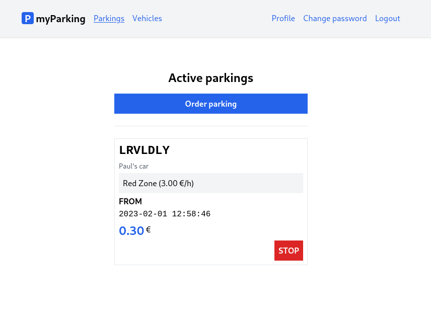

# Lesson 16 - View the active parking list and stop parking

In this lesson, we will display an active parking list with a stop button to end parking.



1. Let's add two more methods into `src/stores/parking.js`.

```js
const parkings = ref([]);

function getActiveParkings() {
  return window.axios.get("parkings").then((response) => {
    parkings.value = response.data.data;
  });
}

function stopParking(parking) {
  window.axios.put(`parkings/${parking.id}`).then(getActiveParkings);
}

return {
  // ...
  parkings,
  getActiveParkings,
  stopParking,
};
```

`getActiveParkings()` will get the currently active parking list. `stopParking()` will accept `parking` as a parameter to know which active parking should be stopped when you press the button. The active parking list will be rerendered after fetching data. `parkings` variable is going to represent an array we will iterate in the `ActiveParkings.vue` component.

2. Update the `src/views/Parkings/ActiveParkings.vue` component to:

```vue
<script setup>
import { onBeforeUnmount } from "vue";
import { useParking } from "@/stores/parking";

const store = useParking();

store.getActiveParkings();

function poll(callback) {
  return setInterval(callback, 3000);
}

const interval = poll(store.getActiveParkings);

onBeforeUnmount(() => clearInterval(interval));
</script>

<template>
  <div class="flex flex-col mx-auto md:w-96 w-full">
    <h1 class="text-2xl font-bold mb-4 text-center">Active parkings</h1>

    <RouterLink
      :to="{ name: 'parkings.create' }"
      class="btn btn-primary w-full"
    >
      Order parking
    </RouterLink>

    <div class="border-t h-[1px] my-6"></div>

    <div class="flex flex-col gap-1">
      <div
        v-for="parking in store.parkings"
        :key="parking.id"
        class="flex flex-col p-2 border gap-1"
      >
        <div class="plate text-2xl">{{ parking.vehicle.plate_number }}</div>
        <div class="text-sm text-gray-600">
          {{ parking.vehicle.description }}
        </div>
        <div class="bg-gray-100 p-2">
          {{ parking.zone.name }}
          ({{ (parking.zone.price_per_hour / 100).toFixed(2) }} &euro;/h)
        </div>
        <div>
          <div class="font-bold uppercase">from</div>
          <span class="font-mono">{{ parking.start_time }}</span>
        </div>
        <div class="flex items-top">
          <span class="text-2xl font-bold text-blue-600">{{
            (parking.total_price / 100).toFixed(2)
          }}</span>
          <span class="pt-0.5">&nbsp;&euro;</span>
        </div>
        <button
          type="button"
          @click="store.stopParking(parking)"
          class="btn btn-danger uppercase ml-auto"
        >
          stop
        </button>
      </div>
    </div>
  </div>
</template>
```

`store.parkings` list now looks like that:

```json
[
    {
        "id": 3,
        "zone": {
            "name": "Red Zone",
            "price_per_hour": 300
        },
        "vehicle": {
            "plate_number": "lrvldly",
            "description": "Paul's car"
        },
        "start_time": "2023-02-01 12:58:46",
        "stop_time": null,
        "total_price": 795
    }
]
```

And we can format the data in the same fashion we did in the previous lesson. `price_per_hour` and `total_price` is formatted using the `toFixed()` method after division.

```js
{{ (parking.zone.price_per_hour / 100).toFixed(2) }}
{{ (parking.total_price / 100).toFixed(2) }}
```

To update data in "real-time" when we have this page open, we can use the `setInterval()` function to poll the server let's say every 3 seconds.

```js
store.getActiveParkings();

function poll(callback) {
  return setInterval(callback, 3000);
}

const interval = poll(store.getActiveParkings);

onBeforeUnmount(() => clearInterval(interval));
```

We define the `poll()` function which accepts a function as a parameter. We store interval returned by `poll()` so later when we leave this route and the component is destroyed we can also destroy created interval using  `clearInterval()`. If we didn't do that sometimes you can get into a situation where the application keeps polling the server even if you don't need that.

3. Add CSS class `btn-danger` for the stop button in `src/assets/main.css`

```css
.btn-danger {
    @apply text-white bg-red-600 hover:bg-red-500;
}
```

Now we can start/stop parking and see how our price increases over time.

4. There's one more tweak we can do to our application. Remember when a user logins or registers it always gets redirected to the `vehicles.index` page. As we now have an `ActiveParkings` page it makes more sense to have the following logic:

- Registered user - is redirected to `vehicles.index`, because to order parking you must have a vehicle.
- The user who just logs in - is redirected to `parking.active`. Probably it already has his vehicles set up, and just wants to use the application for intended its purpose.

5. Update `login()` function in `src/stores/auth.js` file:

from:

```js
function login(accessToken, origin = "login") {
  setAccessToken(accessToken);

  router.push({ name: "vehicles.index" });
}
```

to:

```js
function login(accessToken, origin = "login") {
  setAccessToken(accessToken);

  if (origin === "login") return router.push({ name: "parkings.active" });
  if (origin === "register") return router.push({ name: "vehicles.index" });
}
```

Here we added a second parameter `origin` to know where from we are calling this function, and according to that we redirect the user either to `vehicles.index` or `parkings.active`.

6. So now we need to update `handleSubmit()` function in `src/stores/register.js` store.

In a place where we call `auth.login()` add a second parameter that says `register`.

from:

```js
auth.login(response.data.access_token);
```

to:

```js
auth.login(response.data.access_token, "register");
```

7. We can also update `guest` "middleware" in our routes file `src/router/index.js`.

from:

```js
function guest(to, from, next) {
  if (localStorage.getItem("access_token")) {
    return next({ name: "vehicles.index" });
  }

  next();
}
```

to:

```js
function guest(to, from, next) {
  if (localStorage.getItem("access_token")) {
    return next({ name: "parkings.active" });
  }

  next();
}
```

This means if the logged-in user tried to access for example `/register` URL, it will be redirected to the `parkings.active` route instead of the `vehicles.index` route.
