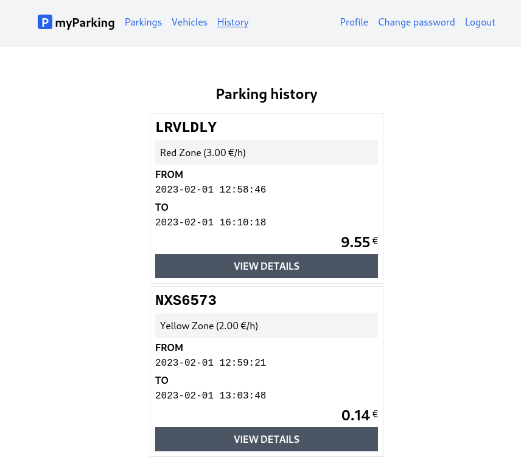

# Lesson 17 - Parking history page

Now when we stop parking it just disappears from the active parking list. This was planned to separate parking orders into `active` and `history` categories so they don't get in the way of each other and are more convenient.

Let's implement the parking history list in this lesson.



1. Extend parking store `src/stores/parking.js`.

```js
const stoppedParkings = ref([]);

function getStoppedParkings() {
  return window.axios.get("parkings/history").then((response) => {
    stoppedParkings.value = response.data.data;
  });
}

return {
  // ...
  stoppedParkings,
  getStoppedParkings,
};
```

It is very similar to what we did before by implementing an active parking list. We have another `stoppedParkings` array to store data and a `getStoppedParkins()` method to retrieve data from different URL.

`src/stores/parking.js` now should have the following content:

```js
import { reactive, ref } from "vue";
import { defineStore } from "pinia";
import { useRouter } from "vue-router";

export const useParking = defineStore("parking", () => {
  const router = useRouter();
  const errors = reactive({});
  const loading = ref(false);
  const parkings = ref([]);
  const stoppedParkings = ref([]);
  const form = reactive({
    vehicle_id: null,
    zone_id: null,
  });

  function resetForm() {
    form.vehicle_id = null;
    form.zone_id = null;

    errors.value = {};
  }

  function startParking() {
    if (loading.value) return;

    loading.value = true;
    errors.value = {};

    return window.axios
      .post("parkings/start", form)
      .then(() => {
        router.push({ name: "parkings.active" });
      })
      .catch((error) => {
        if (error.response.status === 422) {
          errors.value = error.response.data.errors;
        }
      })
      .finally(() => (loading.value = false));
  }

  function getActiveParkings() {
    return window.axios.get("parkings").then((response) => {
      parkings.value = response.data.data;
    });
  }

  function stopParking(parking) {
    window.axios.put(`parkings/${parking.id}`).then(getActiveParkings);
  }

  function getStoppedParkings() {
    return window.axios.get("parkings/history").then((response) => {
      stoppedParkings.value = response.data.data;
    });
  }

  return {
    form,
    errors,
    loading,
    resetForm,
    startParking,
    parkings,
    getActiveParkings,
    stopParking,
    stoppedParkings,
    getStoppedParkings,
  };
});
```

2. Create a new `src/views/Parkings/ParkingHistory.vue` component.

```vue
<script setup>
import { useParking } from "@/stores/parking";

const store = useParking();

store.getStoppedParkings();
</script>

<template>
  <div class="flex flex-col mx-auto md:w-96 w-full">
    <h1 class="text-2xl font-bold mb-4 text-center">Parking history</h1>

    <div class="flex flex-col gap-1">
      <div
        v-for="parking in store.stoppedParkings"
        :key="parking.id"
        class="flex flex-col p-2 border gap-1"
      >
        <div class="plate text-2xl">{{ parking.vehicle.plate_number }}</div>
        <div class="bg-gray-100 p-2">
          {{ parking.zone.name }}
          ({{ (parking.zone.price_per_hour / 100).toFixed(2) }} &euro;/h)
        </div>
        <div>
          <div class="font-bold uppercase">from</div>
          <span class="font-mono">{{ parking.start_time }}</span>
        </div>
        <div>
          <div class="font-bold uppercase">to</div>
          <span class="font-mono">{{ parking.stop_time }}</span>
        </div>
        <div class="flex items-top">
          <span class="text-2xl font-bold ml-auto">{{
            (parking.total_price / 100).toFixed(2)
          }}</span>
          <span class="pt-0.5">&nbsp;&euro;</span>
        </div>
        <button type="button" class="btn btn-secondary uppercase">
          view details
        </button>
      </div>
    </div>
  </div>
</template>
```

This component doesn't have anything new we didn't cover in the previous lesson, and we have put the `view details` button as a placeholder for the next lesson, to view more detailed information about parking orders.

3. Register the route for a newly created component in the `src/router/index.js` file.

```js
{
  path: "/parkings/history",
  name: "parkings.history",
  beforeEnter: auth,
  component: () => import("@/views/Parkings/ParkingHistory.vue"),
},
```

Our all routes should look like this:

```js
import { createRouter, createWebHistory } from "vue-router";

function auth(to, from, next) {
  if (!localStorage.getItem("access_token")) {
    return next({ name: "login" });
  }

  next();
}

function guest(to, from, next) {
  if (localStorage.getItem("access_token")) {
    return next({ name: "parkings.active" });
  }

  next();
}

const router = createRouter({
  history: createWebHistory(import.meta.env.BASE_URL),
  routes: [
    {
      path: "/",
      name: "home",
      component: import("@/views/HomeView.vue"),
    },
    {
      path: "/register",
      name: "register",
      beforeEnter: guest,
      component: () => import("@/views/Auth/RegisterView.vue"),
    },
    {
      path: "/login",
      name: "login",
      beforeEnter: guest,
      component: () => import("@/views/Auth/LoginView.vue"),
    },
    {
      path: "/profile",
      name: "profile.edit",
      beforeEnter: auth,
      component: () => import("@/views/Profile/EditView.vue"),
    },
    {
      path: "/profile/change-password",
      name: "profile.change-password",
      beforeEnter: auth,
      component: () => import("@/views/Profile/ChangePassword.vue"),
    },
    {
      path: "/vehicles",
      name: "vehicles.index",
      beforeEnter: auth,
      component: () => import("@/views/Vehicles/IndexView.vue"),
    },
    {
      path: "/vehicles/create",
      name: "vehicles.create",
      beforeEnter: auth,
      component: () => import("@/views/Vehicles/CreateView.vue"),
    },
    {
      path: "/vehicles/:id/edit",
      name: "vehicles.edit",
      beforeEnter: auth,
      component: () => import("@/views/Vehicles/EditView.vue"),
    },
    {
      path: "/parkings/active",
      name: "parkings.active",
      beforeEnter: auth,
      component: () => import("@/views/Parkings/ActiveParkings.vue"),
    },
    {
      path: "/parkings/new",
      name: "parkings.create",
      beforeEnter: auth,
      component: () => import("@/views/Parkings/OrderParking.vue"),
    },
    {
      path: "/parkings/history",
      name: "parkings.history",
      beforeEnter: auth,
      component: () => import("@/views/Parkings/ParkingHistory.vue"),
    },
  ],
});

export default router;
```

4. Add a button to navigation in `src/App.vue`.

```vue
<RouterLink class="router-link" :to="{ name: 'parkings.history' }">
  History
</RouterLink>
```

And main `src/App.vue` component has the following:

```vue
<script setup>
import { RouterLink, RouterView } from "vue-router";
import { useAuth } from "@/stores/auth";

const auth = useAuth();
</script>

<template>
  <header class="py-6 bg-gray-100 shadow">
    <div class="container md:px-2 px-4 mx-auto">
      <nav class="flex gap-4 justify-between">
        <div class="flex gap-4 items-center">
          <h2 class="text-xl font-bold">
            <div
              class="inline-flex items-center justify-center bg-blue-600 w-6 h-6 text-center text-white rounded"
            >
              P
            </div>
            myParking
          </h2>

          <template v-if="auth.check">
            <RouterLink class="router-link" :to="{ name: 'parkings.active' }">
              Parkings
            </RouterLink>
            <RouterLink class="router-link" :to="{ name: 'vehicles.index' }">
              Vehicles
            </RouterLink>
            <RouterLink class="router-link" :to="{ name: 'parkings.history' }">
              History
            </RouterLink>
          </template>
          <template v-else>
            <RouterLink class="router-link" :to="{ name: 'home' }">
              Home
            </RouterLink>
          </template>
        </div>
        <div class="flex gap-4 items-center">
          <template v-if="auth.check">
            <RouterLink class="router-link" :to="{ name: 'profile.edit' }">
              Profile
            </RouterLink>
            <RouterLink
              class="router-link"
              :to="{ name: 'profile.change-password' }"
            >
              Change password
            </RouterLink>
            <button @click="auth.logout" class="router-link">Logout</button>
          </template>
          <template v-else>
            <RouterLink class="router-link" :to="{ name: 'login' }">
              Login
            </RouterLink>
            <RouterLink class="router-link" :to="{ name: 'register' }">
              Register
            </RouterLink>
          </template>
        </div>
      </nav>
    </div>
  </header>

  <div class="container md:px-2 px-4 pt-8 md:pt-16 mx-auto">
    <RouterView />
  </div>
</template>
```