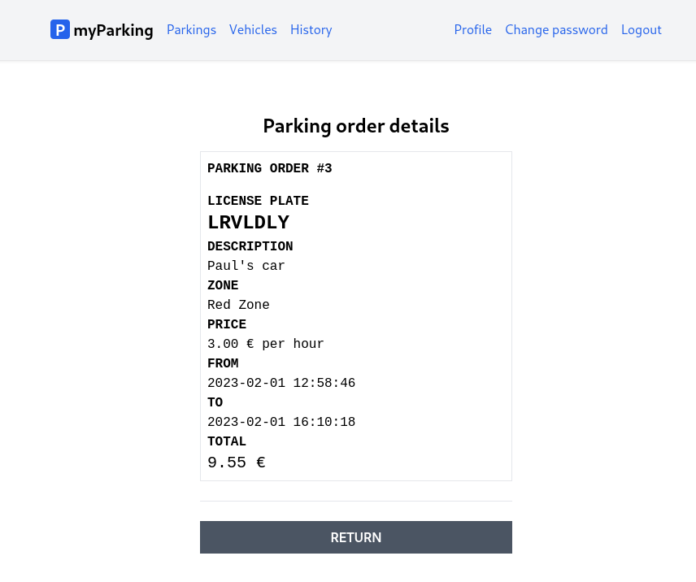

# Lesson 18 - View the parking details page

On the parking history page, we intentionally didn't include all the information about past parking that was stopped and added the view details button.

In this lesson, we will create a parking details page to summarize all the information about past orders.



1. Extend `src/stores/parking.js` store.

```js
const parkingDetails = ref({});

function resetParkingDetails() {
  parkingDetails.value = {};
}

function getParking(parking) {
  return window.axios.get(`parkings/${parking.id}`).then((response) => {
    parkingDetails.value = response.data.data;
  });
}

return {
  //...
  parking: parkingDetails,
  getParking,
  resetParkingDetails,
}
```

`parkingDetails` will hold information about specific parking that API returns to us.

`getParking()` fetches data from API and assigns it to `parkingDetails`. Note that we chose a different name for this variable instead of just simply naming it `parking` because `parking` is also a parameter of a function.

The parking object returned has the following format:

```json
{
    "id": 3,
    "zone": {
        "name": "Red Zone",
        "price_per_hour": 300
    },
    "vehicle": {
        "plate_number": "lrvldly",
        "description": "Paul's car"
    },
    "start_time": "2023-02-01 12:58:46",
    "stop_time": "2023-02-01 16:10:18",
    "total_price": 955
}
```

We can return `parkingDetails` as `parking` in the return statement by assigning `parkingDetails` to a different key `parking`.

```js
return {
  //...
  parking: parkingDetails,
  getParking,
  resetParkingDetails,
}
```

But how does this work? Well, when we are returning values within the object, actually we are using object literal property value shorthand, previous example is completely identical to the following one:

```js
return {
  //...
  parking: parkingDetails,
  getParking: getParking,
  resetParkingDetails: resetParkingDetails,
}
```

The property value shorthand syntax automatically converts each variable to a `key: value` pair with the variable name as a property key and the variable value as a property value.

2. Create a new `src/views/Parkings/ParkingDetails.vue` component.

```vue
<script setup>
import { watchEffect, onBeforeUnmount } from "vue";
import { useParking } from "@/stores/parking";
import { useRoute } from "vue-router";

const store = useParking();
const route = useRoute();

watchEffect(async () => {
  store.getParking({ id: route.params.id });
});

onBeforeUnmount(store.resetParkingDetails);
</script>

<template>
  <div
    class="flex flex-col mx-auto md:w-96 w-full"
    v-if="store.parking.id !== undefined"
  >
    <h1 class="text-2xl font-bold mb-4 text-center">Parking order details</h1>

    <div class="border p-2 font-mono">
      <div class="font-bold uppercase mb-4">
        parking order #{{ store.parking.id }}
      </div>

      <div class="font-bold uppercase">license plate</div>
      <div class="plate text-2xl">{{ store.parking.vehicle.plate_number }}</div>

      <div class="font-bold uppercase">description</div>
      <div>{{ store.parking.vehicle.description }}</div>

      <div class="font-bold uppercase">zone</div>
      <div>{{ store.parking.zone.name }}</div>

      <div class="font-bold uppercase">price</div>
      <div>
        {{ (store.parking.zone.price_per_hour / 100).toFixed(2) }} &euro; per
        hour
      </div>

      <div class="font-bold uppercase">from</div>
      <div>{{ store.parking.start_time }}</div>

      <div class="font-bold uppercase">to</div>
      <div>{{ store.parking.stop_time }}</div>

      <div class="font-bold uppercase">total</div>
      <div class="text-xl">
        {{ (store.parking.total_price / 100).toFixed(2) }} &euro;
      </div>
    </div>

    <div class="border-t h-[1px] my-6"></div>

    <RouterLink
      :to="{ name: 'parkings.history' }"
      class="btn btn-secondary uppercase"
    >
      return
    </RouterLink>
  </div>
</template>
```

Here we hide the card completely unless `store.parking.id` exists. If it doesn't it means data isn't fetched yet since the whole `store.parking` object is empty.

```vue
<div
  class="flex flex-col mx-auto md:w-96 w-full"
  v-if="store.parking.id !== undefined"
>
```

3. Register route for component in `src/router/index.js`.

```js
{
  path: "/parkings/:id",
  name: "parkings.show",
  beforeEnter: auth,
  component: () => import("@/views/Parkings/ParkingDetails.vue"),
},
```

We use the route parameter `:id` in the same fashion as described in the previous lesson where when creating the `Vehicles/EditView.vue` component.

The full content of `src/router/index.js`:

```js
import { createRouter, createWebHistory } from "vue-router";

function auth(to, from, next) {
  if (!localStorage.getItem("access_token")) {
    return next({ name: "login" });
  }

  next();
}

function guest(to, from, next) {
  if (localStorage.getItem("access_token")) {
    return next({ name: "parkings.active" });
  }

  next();
}

const router = createRouter({
  history: createWebHistory(import.meta.env.BASE_URL),
  routes: [
    {
      path: "/",
      name: "home",
      component: import("@/views/HomeView.vue"),
    },
    {
      path: "/register",
      name: "register",
      beforeEnter: guest,
      component: () => import("@/views/Auth/RegisterView.vue"),
    },
    {
      path: "/login",
      name: "login",
      beforeEnter: guest,
      component: () => import("@/views/Auth/LoginView.vue"),
    },
    {
      path: "/profile",
      name: "profile.edit",
      beforeEnter: auth,
      component: () => import("@/views/Profile/EditView.vue"),
    },
    {
      path: "/profile/change-password",
      name: "profile.change-password",
      beforeEnter: auth,
      component: () => import("@/views/Profile/ChangePassword.vue"),
    },
    {
      path: "/vehicles",
      name: "vehicles.index",
      beforeEnter: auth,
      component: () => import("@/views/Vehicles/IndexView.vue"),
    },
    {
      path: "/vehicles/create",
      name: "vehicles.create",
      beforeEnter: auth,
      component: () => import("@/views/Vehicles/CreateView.vue"),
    },
    {
      path: "/vehicles/:id/edit",
      name: "vehicles.edit",
      beforeEnter: auth,
      component: () => import("@/views/Vehicles/EditView.vue"),
    },
    {
      path: "/parkings/active",
      name: "parkings.active",
      beforeEnter: auth,
      component: () => import("@/views/Parkings/ActiveParkings.vue"),
    },
    {
      path: "/parkings/new",
      name: "parkings.create",
      beforeEnter: auth,
      component: () => import("@/views/Parkings/OrderParking.vue"),
    },
    {
      path: "/parkings/history",
      name: "parkings.history",
      beforeEnter: auth,
      component: () => import("@/views/Parkings/ParkingHistory.vue"),
    },
    {
      path: "/parkings/:id",
      name: "parkings.show",
      beforeEnter: auth,
      component: () => import("@/views/Parkings/ParkingDetails.vue"),
    },
  ],
});

export default router;
```

4. And last step is to replace the button in the `src/views/Parkings/ParkingHistory.vue` component to glue our final component to the client application.

from:

```vue
<button type="button" class="btn btn-secondary uppercase">
  view details
</button>
```

to:

```vue
<RouterLink
  :to="{ name: 'parkings.show', params: { id: parking.id } }"
  class="btn btn-secondary uppercase"
>
  view details
</RouterLink>
```

