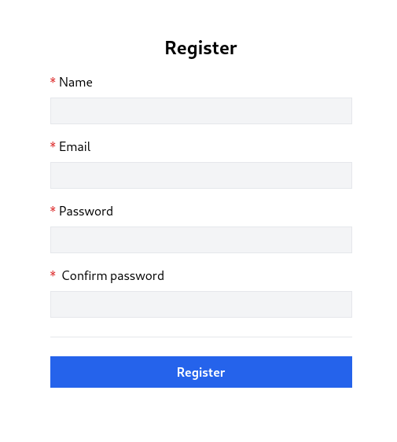

# Lesson 3 - Register page

In this lesson, we are going to create a Register page, make some app layouts, and, add routes with links.

1. Register page template

First, create a new vue component `src/views/Auth/RegisterView.vue`

```vue
<template>
  <form @submit.prevent="() => {}" novalidate>
    <div class="flex flex-col mx-auto md:w-96 w-full">
	  <h1 class="text-2xl font-bold mb-4 text-center">Register</h1>
      <div class="flex flex-col gap-2 mb-4">
        <label for="name" class="required">Name</label>
        <input
          id="name"
          name="name"
          type="text"
          class="form-input"
          autocomplete="name"
          required
        />
      </div>

      <div class="flex flex-col gap-2 mb-4">
        <label for="email" class="required">Email</label>
        <input
          id="email"
          name="email"
          type="email"
          class="form-input"
          autocomplete="email"
          required
        />
      </div>

      <div class="flex flex-col gap-2 mb-4">
        <label for="password" class="required">Password</label>
        <input
          id="password"
          name="password"
          type="password"
          class="form-input"
          autocomplete="new-password"
          required
        />
      </div>

      <div class="flex flex-col gap-2">
        <label for="password_confirmation" class="required">
          Confirm password
        </label>
        <input
          id="password_confirmation"
          name="password_confirmation"
          type="password"
          class="form-input"
          autocomplete="new-password"
          required
        />
      </div>

      <div class="border-t h-[1px] my-6"></div>

      <div class="flex flex-col gap-2">
        <button type="submit" class="btn btn-primary">Register</button>
      </div>
    </div>
  </form>
</template>
```

This is an ordinary form to display our registration form. There are a few things I'd like to address. The form has `@submit.prevent` which means when we submit the form vue prevents its default behavior, otherwise, the page would just reload, so we do not want that. The value of `@submit.prevent` is a callback or a function that will be called when you submit the form, in this case, it is just an empty function and will be implemented in later lessons. `novalidate` attribute tells the browser not to attempt any field validation by default, because we will implement validation to be done by the server every time the form is submitted.

```vue
<form @submit.prevent="() => {}" novalidate>
```

Another not-so-important but rather convenient thing for users is `autocomplete` attributes on form fields. It defines what type of values can be auto-filled by the browser or for example password managers to generate a new password if the user uses any. More information can be found there [# HTML attribute: autocomplete](https://developer.mozilla.org/en-US/docs/Web/HTML/Attributes/autocomplete).

We also added our classes to style repetitive HTML tags such as `input`, `label`, and `button`. There is only one button now, but we will have more of them in the future. So let's define those classes and apply tailwind styles for them in `src/assets/main.css` file:

```
@tailwind base;
@tailwind components;
@tailwind utilities;

@layer components {
    label.required {
        @apply before:text-red-600 before:content-['*'] before:mr-1;
    }

    .form-input {
        @apply p-1 border bg-gray-100 disabled:opacity-50;
    }

    .btn {
        @apply inline-flex items-center gap-2 justify-center p-2 font-bold relative disabled:!opacity-50 disabled:!cursor-progress;
    }

    .btn-primary {
        @apply text-white bg-blue-600 hover:bg-blue-500;
    }
}
```

2. Define `/register` route

To be able to view that form, we need to register the route and the view for a component. Define the route with the following content in `src/router/index.js` file `routes` array:

```js
{
  path: "/register",
  name: "register",
  component: () => import("@/views/Auth/RegisterView.vue"),
},
```

- path - the URL your app visitor will see in the browser
- name - is the name of your route and also can be called a reference, so if you later decide to change path, you don't need to update the path in all your components.
- component - accepts component or function which returns component. We chose to define an anonymous function that returns imported `RegisterView`. This generates a separate chunk (small js file) for this route which is lazy-loaded when the route is visited.

Instead of using the relative path `../views/Auth/RegisterView.vue` we wrote it like that `@/views/Auth/RegisterView.vue`. The `@` symbol is an alias to the `src` directory defined in the `vite.config.js` file. This has an advantage over relative paths because you don't need to update import statements if you decide to move a file containing these references to another folder.

3. Update the parent template

Now we can update the `src/App.vue` file by adding a navigation bar to switch between `HomeView` and `RegisterView`:

```vue
<script setup>
import { RouterLink, RouterView } from "vue-router";
</script>

<template>
  <header class="py-6 bg-gray-100 shadow">
    <div class="container md:px-2 px-4 mx-auto">
      <nav class="flex gap-4 justify-between">
        <div class="flex gap-4 items-center">
          <h2 class="text-xl font-bold">
            <div
              class="inline-flex items-center justify-center bg-blue-600 w-6 h-6 text-center text-white rounded"
            >
              P
            </div>
            myParking
          </h2>
          <RouterLink class="router-link" :to="{ name: 'home' }">
            Home
          </RouterLink>
        </div>
        <div class="flex gap-4 items-center">
          <RouterLink class="router-link" :to="{ name: 'register' }">
            Register
          </RouterLink>
        </div>
      </nav>
    </div>
  </header>

  <div class="container md:px-2 px-4 pt-8 md:pt-16 mx-auto">
    <RouterView />
  </div>
</template>
```

Instead of hardcoding URLs like before `<RouterLink to="/">Home</RouterLink>` we use named routes like that:

```vue
<RouterLink class="router-link" :to="{ name: 'register' }">
Register
</RouterLink>
```

And finally, let's add our `.router-link` CSS class into the components section of the `src/assets/main.css` file:

```
.router-link {
	@apply text-blue-600 hover:underline;
}

.router-link-active.router-link {
	@apply underline;
}
```

The final result with working navigation should look like this:

