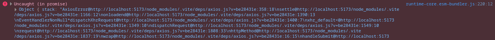
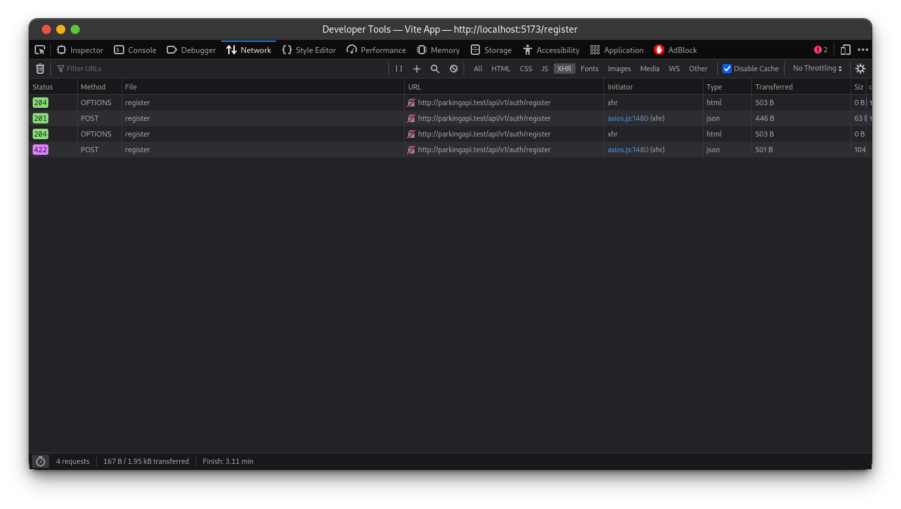

# Lesson 4 - Register implementation

In this lesson, we will learn how to work with Pinia to manage the state and values used for the form, and how to send a request to the server using the Axios library when a user submits the form and reads the response from the server.

First, we need to install the Axios library for requests to API:

```shell
npm install axios --save
```

Then create a new file `src/bootstrap.js` with the following content:

```js
import axios from "axios";

window.axios = axios;

window.axios.defaults.headers.common["X-Requested-With"] = "XMLHttpRequest";
window.axios.defaults.withCredentials = true;
window.axios.defaults.baseURL = "http://parkingapi.test/api/v1";
```

We set `X-Requested-With` header to tell the server it is an XHR request, and it serves an additional purpose so the server must consent to CORS policies.

Option `window.axios.defaults.withCredentials = true;` tells the axios library to send the cookies along the request.

The convenience option is `window.axios.defaults.baseURL = "http://parkingapi.test/api/v1";` so we can omit full URLs in our requests and just type in the relative path of the server's API endpoint.

After that we need to import `src/bootstrap.js` file into `src/main.js`, this can be seen in the first line:

```js
import "@/bootstrap.js";

import { createApp } from "vue";
import { createPinia } from "pinia";

import App from "./App.vue";
import router from "./router";

import "./assets/main.css";

const app = createApp(App);

app.use(createPinia());
app.use(router);

app.mount("#app");
```

Now we have a setup for making requests to API. Now it is time to implement our store. Create a new `src/stores/register.js` file as follows:

```js
import { reactive } from "vue";
import { defineStore } from "pinia";

export const useRegister = defineStore("register", () => {
  const form = reactive({
    name: "",
    email: "",
    password: "",
    password_confirmation: "",
  });

  function resetForm() {
    form.name = "";
    form.email = "";
    form.password = "";
    form.password_confirmation = "";
  }

  async function handleSubmit() {
    return window.axios.post("auth/register", form).then((response) => {
      console.log(response.data);
    });
  }

  return { form, resetForm, handleSubmit };
});
```

We define the reactive object `form` with the `reactive()` function. An object contains keys we are going to use on the register page, these values will update automatically when the value of the input field changes.

> Reactive objects are JavaScript Proxies and behave just like normal objects. The difference is that Vue can track the property access and mutations of a reactive object. Read more on [reactivity fundamentals](https://vuejs.org/guide/essentials/reactivity-fundamentals.html#declaring-reactive-state). If you're curious about the details or not familiar with reactivity it is explained in the official Vue guide [reactivity in depth](https://vuejs.org/guide/extras/reactivity-in-depth.html).

Method `resetForm()` will be used to clear all form fields when the `RegisterView` component is unmounted, because the state is persistent across the application.

Method `handleSubmit()` requests the server, and prints the response to the console, in future lessons we will change that to save the returned token from the response and redirect the user to the login area. As we can see for the axios `post` method we define relative URL, because the `baseURL` option was added earlier.

Time to update our `src/views/Auth/RegisterView.vue`:

```vue
<script setup>
import { onBeforeUnmount } from "vue";
import { useRegister } from "@/stores/register";

const store = useRegister();

onBeforeUnmount(store.resetForm);
</script>

<template>
  <form @submit.prevent="store.handleSubmit" novalidate>
    <div class="flex flex-col mx-auto md:w-96 w-full">
	  <h1 class="text-2xl font-bold mb-4 text-center">Register</h1>
      <div class="flex flex-col gap-2 mb-4">
        <label for="name" class="required">Name</label>
        <input
          v-model="store.form.name"
          id="name"
          name="name"
          type="text"
          class="form-input"
          autocomplete="name"
          required
        />
      </div>

      <div class="flex flex-col gap-2 mb-4">
        <label for="email" class="required">Email</label>
        <input
          v-model="store.form.email"
          id="email"
          name="email"
          type="email"
          class="form-input"
          autocomplete="email"
          required
        />
      </div>

      <div class="flex flex-col gap-2 mb-4">
        <label for="password" class="required">Password</label>
        <input
          v-model="store.form.password"
          id="password"
          name="password"
          type="password"
          class="form-input"
          autocomplete="new-password"
          required
        />
      </div>

      <div class="flex flex-col gap-2">
        <label for="password_confirmation" class="required">
	      Confirm password
	    </label>
        <input
          v-model="store.form.password_confirmation"
          id="password_confirmation"
          name="password_confirmation"
          type="password"
          class="form-input"
          autocomplete="new-password"
          required
        />
      </div>

      <div class="border-t h-[1px] my-6"></div>

      <div class="flex flex-col gap-2">
        <button type="submit" class="btn btn-primary">Register</button>
      </div>
    </div>
  </form>
</template>
```

The whole new section was added to our register component:

```vue
<script setup>
import { onBeforeUnmount } from "vue";
import { useRegister } from "@/stores/register";

const store = useRegister();

onBeforeUnmount(store.resetForm);
</script>
```

To make our store available first we import the `useRegister` function from the store we defined and then assigning it to a constant `const store = useRegister();`

`onBeforeUnmount` - registers a hook to be called right before a component instance is to be unmounted and accepts another function as a parameter. Notice `store.resetForm` is passed which is a function reference as opposed to `store.resetForm()` which would be an immediate function call.

Values from the store to input fields are bound using the `v-model` directive, for example: `<input v-model="store.form.email" />`. All form input fields now have a `v-model` directive with corresponding values.

Empty function on form submit gets replaced with `store.handleSubmit`: `<form @submit.prevent="store.handleSubmit" novalidate>`. It is called when the form gets submitted.

After submitting the form the following output can be seen in the console:

```js
Object { access_token: "118|CJv0t9yHJcPFsifkXyoMaiCJBpRyrmsXYDLENyAN" }
```

This means everything went right and the user was registered, later we will cover that but one thing at a time. Yet we still have another thing missing. What if we press the button again? Oh no, we got an error in the console:



Let's inspect the network tab on the browser's dev tools:



The server denied our request with 422 Unprocessable Entity response code, this means that we have some sort of data validation error. We tried to register another user with the same credentials and the user doesn't even know why this happened in the first place.

Let's move to another lesson and handle form validation.
