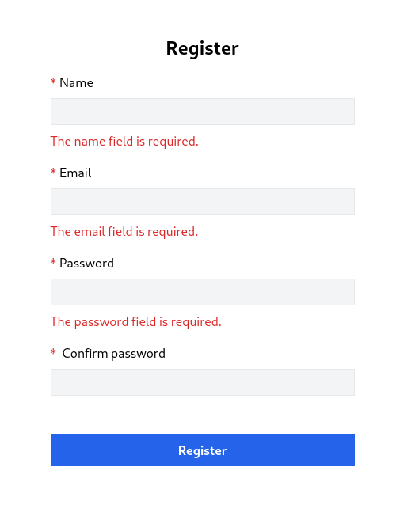

# Lesson 5 - Validation and register form

Our objective in this lesson is to display form errors on the client side.



## Extending register store

When submitting forms it is crucial to indicate if the server doesn't accept the request and if some information provided needs to be clarified. In such cases, Laravel returns a response with more details. In our case, if we submit an empty form Laravel returns a response with a 422 status code with an object which looks like this:

```json
{
    "message": "The name field is required. (and 2 more errors)",
    "errors": {
        "name": [
            "The name field is required."
        ],
        "email": [
            "The email field is required."
        ],
        "password": [
            "The password field is required."
        ]
    }
}
```

Considering that we are going to have more forms in the future it is a good idea to have a component where we can pass errors object and a field name to display particular error messages under the specific field.

Now let's extend our register store `src/stores/register.js` by adding a new reactive object called `errors`, this is where we are going to store the errors object returned from the backend.

```js
const errors = reactive({});
```

Then extend the `handleSubmit` method by adding a `catch` clause, and if it is a validation error assign a response with errors to our defined reactive `errors` object.

```js
async function handleSubmit() {
  errors.value = {};

  return window.axios
    .post("auth/register", form)
    .then((response) => {
      console.log(response.data);
    })
    .catch((error) => {
      if (error.response.status === 422) {
        errors.value = error.response.data.errors;
      }
    })
    .finally(() => {
      form.password = "";
      form.password_confirmation = "";
    });
}
```

Since Vue's reactivity tracking works over property access, we must always keep the same reference to the reactive object. This means we can't easily "replace" a reactive object because the reactivity connection to the first reference is lost.

This is the reason why we assign `error.response.data.errors` to the key named `value` and not directly to the object.

```js
// 🚫 Bad
errors = error.response.data.errors;
```

```js
// ✅ Good
errors.value = error.response.data.errors;
```

On every new submission, we want to clear the `errors` object value key, this is done with `errors.value = {};` line.

We also added `finally()` code block:

```js
    // ...
    .finally(() => {
      form.password = "";
      form.password_confirmation = "";
    });
```

Usually when you submit the form browser would automatically clear fields with `type="password"`, but because we are preventing default behavior this won't happen by default and we need to do that manually to retain the same functionality. Code in the `finally()` clause will be always executed disregarding if the request resulted in success or error.

The `resetForm()` method also is extended by clearing validation errors along the fields.

```js
function resetForm() {
  form.name = "";
  form.email = "";
  form.password = "";
  form.password_confirmation = "";

  errors.value = {};
}
```

The last thing is to add an `errors` object to the return statement, so we can use that in our components.

```js
return { form, errors, resetForm, handleSubmit };
```

Our store  `src/stores/register.js` with all changes now should look like that:

```js
import { reactive } from "vue";
import { defineStore } from "pinia";

export const useRegister = defineStore("register", () => {
  const errors = reactive({});
  const form = reactive({
    name: "",
    email: "",
    password: "",
    password_confirmation: "",
  });

  function resetForm() {
    form.name = "";
    form.email = "";
    form.password = "";
    form.password_confirmation = "";

    errors.value = {};
  }

  async function handleSubmit() {
    errors.value = {};

    return window.axios
      .post("auth/register", form)
      .then((response) => {
        console.log(response.data);
      })
      .catch((error) => {
        if (error.response.status === 422) {
          errors.value = error.response.data.errors;
        }
      })
      .finally(() => {
        form.password = "";
        form.password_confirmation = "";
      });
  }

  return { form, errors, resetForm, handleSubmit };
});
```

When a validation error happens now our errors object will contain data in such format:

```json
{
    "value": {
        "errors": {
            "name": [
                "The name field is required."
            ],
            "email": [
                "The email field is required."
            ],
            "password": [
                "The password field is required."
            ]
        }
    }
}
```

## Validation component

The store has been set up and it is clear how error data is stored. Now it is a lot easier to implement the component to display error messages in form.

Create a new `src/components/ValidationError.vue` component:

```vue
<script setup>
import { defineProps } from "vue";
const props = defineProps(["errors", "field"]);
</script>

<template>
  <ul
    v-if="props?.errors?.value?.[props.field]?.length"
    class="flex flex-col text-red-600 gap-1"
  >
    <li v-for="message in props.errors.value[props.field]" :key="message">
      {{ message }}
    </li>
  </ul>
</template>
```

For the component to accept properties we need to import the `defineProps` method from `vue`. Here we define two properties `errors` and `field`. `errors` will be our errors object passed from the store, and `field` will contain the field key to display a specific error message.

Now we need to import the `ValidationError` component into our `RegisterView` to be able to consume it, but is a bit inconvenient, because `ValidationError` will be heavily reused in the whole application, so it is better to register it globally.

This can be done by importing it in `src/main.js`, along with where Vue is initialized.

```js
import ValidationError from "@/components/ValidationError.vue";
```

And then register it:

```js
app.component("ValidationError", ValidationError);
```

Now `src/main.js` has the following contents:

```js
import "@/bootstrap.js";

import { createApp } from "vue";
import { createPinia } from "pinia";

import App from "./App.vue";
import router from "./router";
import ValidationError from "@/components/ValidationError.vue";

import "./assets/main.css";

const app = createApp(App);

app.use(createPinia());
app.use(router);
app.component("ValidationError", ValidationError);

app.mount("#app");
```

To display error messages is pretty straightforward now, we need to add only 3 lines of code to `src/views/Auth/RegisterView.vue` under every input field to display errors:

```vue
<ValidationError :errors="store.errors" field="name" />
<ValidationError :errors="store.errors" field="email" />
<ValidationError :errors="store.errors" field="password" />
```

> `password_confirmation` field never returns error messages, so we do not need to add it there. Password-related errors are always returned under the `password` key.

The final result of `src/views/Auth/RegisterView.vue`:

```vue
<script setup>
import { onBeforeUnmount } from "vue";
import { useRegister } from "@/stores/register";

const store = useRegister();

onBeforeUnmount(store.resetForm);
</script>

<template>
  <form @submit.prevent="store.handleSubmit" novalidate>
    <div class="flex flex-col mx-auto md:w-96 w-full">
	  <h1 class="text-2xl font-bold mb-4 text-center">Register</h1>
      <div class="flex flex-col gap-2 mb-4">
        <label for="name" class="required">Name</label>
        <input
          v-model="store.form.name"
          id="name"
          name="name"
          type="text"
          class="form-input"
          autocomplete="name"
          required
        />
        <ValidationError :errors="store.errors" field="name" />
      </div>

      <div class="flex flex-col gap-2 mb-4">
        <label for="email" class="required">Email</label>
        <input
          v-model="store.form.email"
          id="email"
          name="email"
          type="email"
          class="form-input"
          autocomplete="email"
          required
        />
        <ValidationError :errors="store.errors" field="email" />
      </div>

      <div class="flex flex-col gap-2 mb-4">
        <label for="password" class="required">Password</label>
        <input
          v-model="store.form.password"
          id="password"
          name="password"
          type="password"
          class="form-input"
          autocomplete="new-password"
          required
        />
        <ValidationError :errors="store.errors" field="password" />
      </div>

      <div class="flex flex-col gap-2">
        <label for="password_confirmation" class="required">
          Confirm password
        </label>
        <input
          v-model="store.form.password_confirmation"
          id="password_confirmation"
          name="password_confirmation"
          type="password"
          class="form-input"
          autocomplete="new-password"
          required
        />
      </div>

      <div class="border-t h-[1px] my-6"></div>

      <div class="flex flex-col gap-2">
        <button type="submit" class="btn btn-primary">Register</button>
      </div>
    </div>
  </form>
</template>
```
