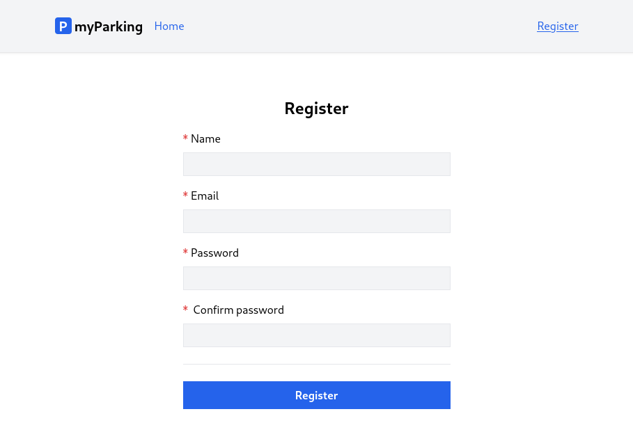
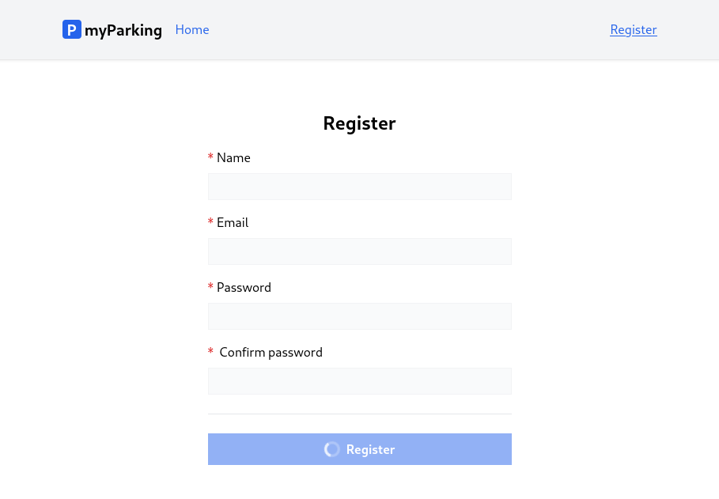

# Lesson 6 - Loading state and register form

In this lesson, when a user submits the form, we are going to indicate if the form is being processed to give the user some feedback to have a more pleasant user experience.

Before submit:



Right after the form is submitted and the client waits for a response:



## Spinner component

By looking at the result we can immediately see that there is a new thing in the form, it is a loading indicator on the button.

Create a new component `src/components/IconSpinner.vue` with the following content:

```vue
<template>
  <svg
    class="animate-spin h-5 w-5 text-white"
    xmlns="http://www.w3.org/2000/svg"
    fill="none"
    viewBox="0 0 24 24"
  >
    <circle
      class="opacity-25"
      cx="12"
      cy="12"
      r="10"
      stroke="currentColor"
      stroke-width="4"
    ></circle>
    <path
      class="opacity-75"
      fill="currentColor"
      d="M4 12a8 8 0 018-8V0C5.373 0 0 5.373 0 12h4zm2 5.291A7.962 7.962 0 014 12H0c0 3.042 1.135 5.824 3 7.938l3-2.647z"
    ></path>
  </svg>
</template>
```

The component consists of an HTML template containing an SVG icon and some TailwindCSS classes. `animate-spin` class applies persistent rotation animation on the icon.

Then register the component globally in the `src/main.js` file as we did in the previous lesson.

```js
import IconSpinner from "@/components/IconSpinner.vue";

// ...

app.component("IconSpinner", IconSpinner);
```

It should look like this now:

```js
import "@/bootstrap.js";

import { createApp } from "vue";
import { createPinia } from "pinia";

import App from "./App.vue";
import router from "./router";
import ValidationError from "@/components/ValidationError.vue";
import IconSpinner from "@/components/IconSpinner.vue";

import "./assets/main.css";

const app = createApp(App);

app.use(createPinia());
app.use(router);
app.component("ValidationError", ValidationError);
app.component("IconSpinner", IconSpinner);

app.mount("#app");
```

## Extending register store

In `src/stores/register.js` we need to import another function called `ref()`. The reason is that `reactive()` only works for object types (objects, arrays, and collection types such as `Map` and `Set`). It cannot hold primitive types such as `string`, `number`, or `boolean`.

```js
import { reactive, ref } from "vue";
```

Define the new store variable `loading`. It will have only 2 states, loading or not, so `boolean` perfectly suits our scenario.

```js
const loading = ref(false);
```

And update method `handleSubmit()` to:

```js
async function handleSubmit() {
  if (loading.value) return;

  loading.value = true;
  errors.value = {};

  return window.axios
    .post("auth/register", form)
    .then((response) => {
      console.log(response.data);
    })
    .catch((error) => {
      if (error.response.status === 422) {
        errors.value = error.response.data.errors;
      }
    })
    .finally(() => {
      form.password = "";
      form.password_confirmation = "";
      loading.value = false;
    });
}
```

Right in the beginning we added early return `if (loading.value) return;`. The method won't do anything if the request is already being handled. This serves two purposes.

1. Prevents request being sent multiple times if the form was submitted multiple times either by pressing enter or clicking the button multiple times.
2. You might have this method called programmatically and you don't have a reason for this to be called multiple times.

Then we set the loading state to true `loading.value = true;` and when the request is resolved in the `finally()` block we set loading back to `false`.

Do not forget to expose the loading state in the return statement.

```js
return { form, errors, loading, resetForm, handleSubmit };
```

Now `src/stores/register.js` store should look like this:

```js
import { reactive, ref } from "vue";
import { defineStore } from "pinia";

export const useRegister = defineStore("register", () => {
  const errors = reactive({});
  const loading = ref(false);
  const form = reactive({
    name: "",
    email: "",
    password: "",
    password_confirmation: "",
  });

  function resetForm() {
    form.name = "";
    form.email = "";
    form.password = "";
    form.password_confirmation = "";
  }

  async function handleSubmit() {
    if (loading.value) return;

    loading.value = true;
    errors.value = {};

    return window.axios
      .post("auth/register", form)
      .then((response) => {
        console.log(response.data);
      })
      .catch((error) => {
        if (error.response.status === 422) {
          errors.value = error.response.data.errors;
        }
      })
      .finally(() => {
        form.password = "";
        form.password_confirmation = "";
        loading.value = false;
      });
  }

  return { form, errors, loading, resetForm, handleSubmit };
});
```

## Disable form elements and display the loading state

To disable form fields all we need to do is to add the `:disabled="store.loading"` attribute to `<input>` and `<button>` tags. Notice it has a colon `:` before an attribute name. This is a shortcut to the `v-bind` directive to instruct Vue to keep the attribute in sync with the component's properties.

```vue
<... :disabled="store.loading" />
```

And finally, add an icon component inside the `<button>` tag. `v-show` directive renders the component only if the `loading` value evaluates to `true`.

```vue
<IconSpinner v-show="store.loading" />
```

Currently our register view `src/views/Auth/RegisterView.vue` should look like that:

```vue
<script setup>
import { onBeforeUnmount } from "vue";
import { useRegister } from "@/stores/register";

const store = useRegister();

onBeforeUnmount(store.resetForm);
</script>

<template>
  <form @submit.prevent="store.handleSubmit" novalidate>
    <div class="flex flex-col mx-auto md:w-96 w-full">
      <h1 class="text-2xl font-bold mb-4 text-center">Register</h1>
      <div class="flex flex-col gap-2 mb-4">
        <label for="name" class="required">Name</label>
        <input
          v-model="store.form.name"
          id="name"
          name="name"
          type="text"
          class="form-input"
          autocomplete="name"
          required
          :disabled="store.loading"
        />
        <ValidationError :errors="store.errors" field="name" />
      </div>

      <div class="flex flex-col gap-2 mb-4">
        <label for="email" class="required">Email</label>
        <input
          v-model="store.form.email"
          id="email"
          name="email"
          type="email"
          class="form-input"
          autocomplete="email"
          required
          :disabled="store.loading"
        />
        <ValidationError :errors="store.errors" field="email" />
      </div>

      <div class="flex flex-col gap-2 mb-4">
        <label for="password" class="required">Password</label>
        <input
          v-model="store.form.password"
          id="password"
          name="password"
          type="password"
          class="form-input"
          autocomplete="new-password"
          required
          :disabled="store.loading"
        />
        <ValidationError :errors="store.errors" field="password" />
      </div>

      <div class="flex flex-col gap-2">
        <label for="password_confirmation" class="required">
          Confirm password
        </label>
        <input
          v-model="store.form.password_confirmation"
          id="password_confirmation"
          name="password_confirmation"
          type="password"
          class="form-input"
          autocomplete="new-password"
          required
          :disabled="store.loading"
        />
      </div>

      <div class="border-t h-[1px] my-6"></div>

      <div class="flex flex-col gap-2">
        <button type="submit" class="btn btn-primary" :disabled="store.loading">
          <IconSpinner v-show="store.loading" />
          Register
        </button>
      </div>
    </div>
  </form>
</template>
```

## Question: I submit the registration form but can't see the loading state, what to do?

This is normal especially if you work in the local environment, there are several options to trigger the loading state, the easiest ones are:

1. You can just change the `const loading = ref(false);` default value from `false` to `true` and refresh the page. Your form immediately will be in a loading state.
2. To imitate network latency you can add `sleep(3)` at the beginning of your API `RegisterController` to delay the response for 3 seconds. Only if you're working locally and do not forget to remove it.

Congratulations, now you know how to implement the most commonly used practices using forms.

As you noticed we still do have  `console.log(response.data);` after registration was successful. Let's dive into authentication scaffolding.