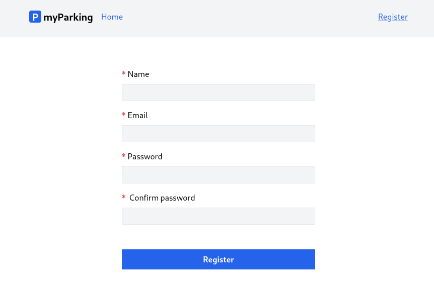
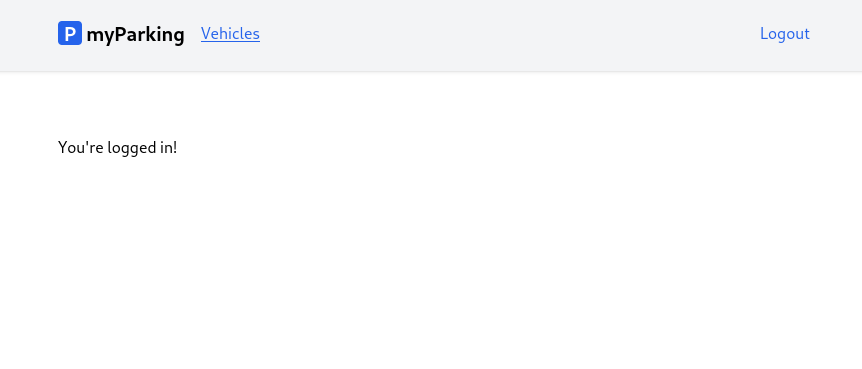

# Lesson 7 - Authentication

We can continue implementing another essential thing for our client and it is authentication and route handling. Our goals for this lesson are:

- Page that the registered user will be redirected to
- Save the token to localStorage
- Allow user to log out
- Protect routes that only authenticated or guest users can see





## View for only authorized users

It is already known that in the future we will want to allow users edit vehicles, so let's create the `src/views/Vehicles/IndexView.vue` component as a placeholder with the following content:

```vue
<template>You're logged in!</template>
```

And register it in routes file `src/router/index.js` to just be able to display it in the client:

```js
{
  path: "/vehicles",
  name: "vehicles.index",
  component: () => import("@/views/Vehicles/IndexView.vue"),
},
```

## Auth store

To work with `localStorage` in store we are going to need a package, install `@vueuse/core` via npm.

```shell
npm install @vueuse/core --save
```

Now we can go with authentication material, time to implement our `src/stores/auth.js` store for authentication methods and save the token in the client.

```js
import { computed } from "vue";
import { defineStore } from "pinia";
import { useStorage } from "@vueuse/core";
import { useRouter } from "vue-router";

export const useAuth = defineStore("auth", () => {
  const router = useRouter();
  const accessToken = useStorage("access_token", "");
  const check = computed(() => !!accessToken.value);

  function setAccessToken(value) {
    accessToken.value = value;
    window.axios.defaults.headers.common[
      "Authorization"
    ] = `Bearer ${accessToken.value}`;
  }

  function login(accessToken) {
    setAccessToken(accessToken);

    router.push({ name: "vehicles.index" });
  }

  function destroyTokenAndRedirectTo(routeName) {
    setAccessToken(null);
    router.push({ name: routeName });
  }

  async function logout() {
    return window.axios.post("auth/logout").finally(() => {
      destroyTokenAndRedirectTo("register");
    });
  }

  return { login, logout, check, destroyTokenAndRedirectTo };
});
```

For navigation `useRouter()` function is used. The URL `router.push('/my-url')` or route name `router.push({ name: 'my-route-name' })` can be used to navigate

```js
const router = useRouter();
```

Using `useStorage()` we bind the `access_token` value from localStorage, if the value doesn't exist in localStorage it defaults to an empty string.

```js
const accessToken = useStorage("access_token", "");
```

Variable `check` will be used to determine if the user is logged in or not, it will hold a boolean and is derived whether accessToken evaluates as true. Similar functionality is observed when you call `auth()->check()` in Laravel. For logic that includes reactive data, it is recommended to use a computed property using the `computed()` function which accepts the getter function.

```js
const check = computed(() => !!accessToken.value);
```

To update accessToken in localStorage we could just assign a new value as `accessToken.value = value`, but we also need to set the Authorization header for axios to secured endpoints, that's the reason we wrap this functionality in a `setAccessToken()` method.

```js
function setAccessToken(value) {
  accessToken.value = value;
  window.axios.defaults.headers.common[
    "Authorization"
  ] = `Bearer ${accessToken.value}`;
}
```

Method `login()` accepts the token, updates both localStorage and axios headers with it, and then redirects to the route name of our choice.

```js
function login(accessToken) {
  setAccessToken(accessToken);

  router.push({ name: "vehicles.index" });
}
```

Method `destroyTokenAndRedirectTo()` will be called when the user logs out, or accessToken is invalid or expired.

```js
function destroyTokenAndRedirectTo(routeName) {
  setAccessToken(null);
  router.push({ name: routeName });
}
```

Method `logout()` sends a request to the server to delete the current token on the server side, and whether it fails or not, destroys the token on the client and redirects to the `register` route.

```js
async function logout() {
  return window.axios.post("auth/logout").finally(() => {
    destroyTokenAndRedirectTo("register");
  });
}
```

And finally exposing store variables to allow access to them outside of the store.

```js
return { login, logout, check, destroyTokenAndRedirectTo };
```

## Update Axios to handle 401 Unauthorized responses

Imagine a scenario when on one device you deauthorize other logins to your account. In that case, to put it simply, the server would delete access tokens and any clients that use them would always receive 401 Unauthorized from our API endpoints. There could be many reasons for that. So we need a way to log out a client automatically if that happens.

To handle such responses we need to add an axios interceptor, a similar concept in Laravel is called middleware.

Edit `src/bootstrap.js` and add a new definition:

```js
import { useAuth } from "@/stores/auth";

window.axios.interceptors.response.use(
  (response) => response,
  (error) => {
    if (error.response?.status === 401) {
      const auth = useAuth();
      auth.destroyTokenAndRedirectTo("register");
    }

    return Promise.reject(error);
  }
);
```

If the response status of ANY request by calling API endpoints using axios is 401, we call `auth.destroyTokenAndRedirectTo("register")` so the current authentication token on the client is destroyed, and the user is redirected to the registration page. We can't use `auth.logout()` for that, because we do not need to make any more requests to the server otherwise it would be an infinite loop. We already know that the access token is invalid.

One more thing missing is that the access token for axios is being set only when we call `setAccessToken()` from auth store. We also need to set that when we load the application for the first time, for example, if you hit the refresh button browser. This can be done by appending the following code:

```js
if (localStorage.getItem("access_token")) {
  window.axios.defaults.headers.common[
    "Authorization"
  ] = `Bearer ${localStorage.getItem("access_token")}`;
}
```

This sets the authorization header for axios to whatever existing value is being held in localStorage.

The final version of `src/bootstrap.js`:

```js
import axios from "axios";
import { useAuth } from "@/stores/auth";

window.axios = axios;

window.axios.defaults.headers.common["X-Requested-With"] = "XMLHttpRequest";
window.axios.defaults.withCredentials = true;
window.axios.defaults.baseURL = "http://parkingapi.test/api/v1";
window.axios.interceptors.response.use(
  (response) => response,
  (error) => {
    if (error.response?.status === 401) {
      const auth = useAuth();
      auth.destroyTokenAndRedirectTo("register");
    }

    return Promise.reject(error);
  }
);

if (localStorage.getItem("access_token")) {
  window.axios.defaults.headers.common[
    "Authorization"
  ] = `Bearer ${localStorage.getItem("access_token")}`;
}
```

## Update register store

Now update `src/stores/register.js` by importing the `useAuth()` function from auth store.

```js
import { useAuth } from "@/stores/auth";
```

Define auth variable to consume auth store.

```js
const auth = useAuth();
```

And replace `console.log(response.data)` in the `handleSubmit()` method with `auth.login(response.data.access_token)`, that's it, no more changes are needed on the register page.

```js
return window.axios
  .post("auth/register", form)
  .then((response) => {
    auth.login(response.data.access_token);
  })
  .catch((error) => {
    if (error.response.status === 422) {
```

Register store `src/stores/register.js` should look like that now :

```js
import { reactive, ref } from "vue";
import { defineStore } from "pinia";
import { useAuth } from "@/stores/auth";

export const useRegister = defineStore("register", () => {
  const auth = useAuth();
  const errors = reactive({});
  const loading = ref(false);
  const form = reactive({
    name: "",
    email: "",
    password: "",
    password_confirmation: "",
  });

  function resetForm() {
    form.name = "";
    form.email = "";
    form.password = "";
    form.password_confirmation = "";

    errors.value = {}
  }

  async function handleSubmit() {
    if (loading.value) return;

    loading.value = true;
    errors.value = {};

    return window.axios
      .post("auth/register", form)
      .then((response) => {
        auth.login(response.data.access_token);
      })
      .catch((error) => {
        if (error.response.status === 422) {
          errors.value = error.response.data.errors;
        }
      })
      .finally(() => {
        form.password = "";
        form.password_confirmation = "";
        loading.value = false;
      });
  }

  return { form, errors, loading, resetForm, handleSubmit };
});
```

When the user registers token will be saved on the client, and the user redirected to the `vehicles.index` route.

## Navigation links

Update the `src/App.vue` component with the following code:

```vue
<script setup>
import { RouterLink, RouterView } from "vue-router";
import { useAuth } from "@/stores/auth";

const auth = useAuth();
</script>

<template>
  <header class="py-6 bg-gray-100 shadow">
    <div class="container md:px-2 px-4 mx-auto">
      <nav class="flex gap-4 justify-between">
        <div class="flex gap-4 items-center">
          <h2 class="text-xl font-bold">
            <div
              class="inline-flex items-center justify-center bg-blue-600 w-6 h-6 text-center text-white rounded"
            >
              P
            </div>
            myParking
          </h2>

          <template v-if="auth.check">
            <RouterLink class="router-link" :to="{ name: 'vehicles.index' }">
              Vehicles
            </RouterLink>
          </template>
          <template v-else>
            <RouterLink class="router-link" :to="{ name: 'home' }">
              Home
            </RouterLink>
          </template>
        </div>
        <div class="flex gap-4 items-center">
          <template v-if="auth.check">
            <button @click="auth.logout" class="router-link">Logout</button>
          </template>
          <template v-else>
            <RouterLink class="router-link" :to="{ name: 'register' }">
              Register
            </RouterLink>
          </template>
        </div>
      </nav>
    </div>
  </header>

  <div class="container md:px-2 px-4 pt-8 md:pt-16 mx-auto">
    <RouterView />
  </div>
</template>
```

Here we import auth store

```js
import { useAuth } from "@/stores/auth";
// ...
const auth = useAuth();
```

Navigation parts are shown/hidden using the `v-if` directive and `auth.check` variable we defined earlier in auth store. So one template will be shown if the user is authenticated, and after `v-else` will be shown to guest users.

When a user clicks the logout button `auth.logout()` will be called from auth store.

Multiple `<template>` tags can also be used in a template, they're just not rendered in DOM, so works perfectly to wrap children with some logic without having actual parent elements. It looks excessive now, but later we will have more links.

```vue
<template v-if="auth.check">
  <button @click="auth.logout" class="router-link">Logout</button>
</template>
<template v-else>
  <RouterLink class="router-link" :to="{ name: 'register' }">
    Register
  </RouterLink>
</template>
```

## Protected routes

So far so good, but what if the unauthenticated user tries to navigate to `/vehicles`? And already authenticated user navigates to `/register`? In both cases, the page will be displayed. This can be not intentional, maybe the user just tried to navigate to a page from history.

Let's add some "gates" to those pages. Define two functions in `src/router/index.js`:

One is to allow only authenticated users to access URLs. So if a user is not authenticated it will be redirected to the `register` route:

```js
function auth(to, from, next) {
  if (!localStorage.getItem("access_token")) {
    return next({ name: "register" });
  }

  next();
}
```

And the other one where only guests should be allowed to see, otherwise if a user is authenticated his "home" now is `vehicles.index` named route where he will be redirected instead:

```js
function guest(to, from, next) {
  if (localStorage.getItem("access_token")) {
    return next({ name: "vehicles.index" });
  }

  next();
}
```

Now update route definitions, on the registration route, add the `beforeEnter: guest` option:

```js
{
  path: "/register",
  name: "register",
  beforeEnter: guest,
  component: () => import("@/views/Auth/RegisterView.vue"),
},
```

And for vehicles.index route add the `beforeEnter: auth` option:

```js
{
  path: "/vehicles",
  name: "vehicles.index",
  beforeEnter: auth,
  component: () => import("@/views/Vehicles/IndexView.vue"),
},
```

So `register` will be available only for guests, and `vehicles.index` for authorized users.

Routes file `src/router/index.js` should look like that:

```js
import { createRouter, createWebHistory } from "vue-router";

function auth(to, from, next) {
  if (!localStorage.getItem("access_token")) {
    return next({ name: "register" });
  }

  next();
}

function guest(to, from, next) {
  if (localStorage.getItem("access_token")) {
    return next({ name: "vehicles.index" });
  }

  next();
}

const router = createRouter({
  history: createWebHistory(import.meta.env.BASE_URL),
  routes: [
    {
      path: "/",
      name: "home",
      component: import("@/views/HomeView.vue"),
    },
    {
      path: "/register",
      name: "register",
      beforeEnter: guest,
      component: () => import("@/views/Auth/RegisterView.vue"),
    },
    {
      path: "/vehicles",
      name: "vehicles.index",
      beforeEnter: auth,
      component: () => import("@/views/Vehicles/IndexView.vue"),
    },
  ],
});

export default router;
```

Now we have implemented all authentication scaffolding by ourselves. Time to add a login page in the next lesson.