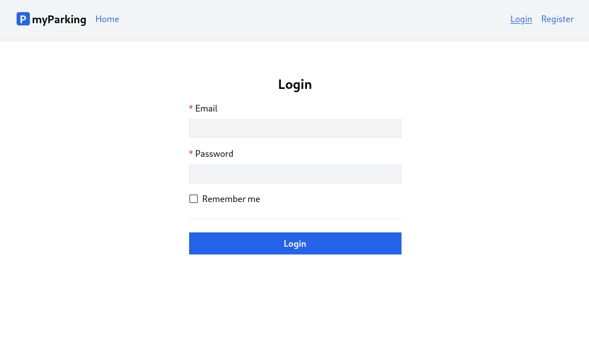

# Lesson 8 - Login page

Creating a login page is now a very trivial task since we have all functionality set up for our application. It will be looking similar to the register page.



## Login store

Create a new store `src/stores/login.js` with the following content:

```js
import { reactive, ref } from "vue";
import { defineStore } from "pinia";
import { useAuth } from "@/stores/auth";

export const useLogin = defineStore("login", () => {
  const auth = useAuth();
  const errors = reactive({});
  const loading = ref(false);
  const form = reactive({
    email: "",
    password: "",
    remember: false,
  });

  function resetForm() {
    form.email = "";
    form.password = "";
    form.remember = false;

    errors.value = {};
  }

  async function handleSubmit() {
    if (loading.value) return;

    loading.value = true;
    errors.value = {};

    return window.axios
      .post("auth/login", form)
      .then((response) => {
        auth.login(response.data.access_token);
      })
      .catch((error) => {
        if (error.response.status === 422) {
          errors.value = error.response.data.errors;
        }
      })
      .finally(() => {
        form.password = "";
        loading.value = false;
      });
  }

  return { form, errors, loading, resetForm, handleSubmit };
});
```

It is almost identical to `src/stores/register.js`, and the structure was explained in previous lessons. Now it has a bit fewer fields, a different `axios.post()` URL, and `form.remember` as a `boolean` value for the checkbox.

## Login view

Create the `src/views/Auth/LoginView.vue` component.

```vue
<script setup>
import { onBeforeUnmount } from "vue";
import { useLogin } from "@/stores/login";

const store = useLogin();

onBeforeUnmount(store.resetForm);
</script>

<template>
  <form @submit.prevent="store.handleSubmit" novalidate>
    <div class="flex flex-col mx-auto md:w-96 w-full">
      <h1 class="text-2xl font-bold mb-4 text-center">Login</h1>
      <div class="flex flex-col gap-2 mb-4">
        <label for="email" class="required">Email</label>
        <input
          v-model="store.form.email"
          id="email"
          name="email"
          type="text"
          class="form-input"
          autofocus
          autocomplete="email"
          required
          :disabled="store.loading"
        />
        <ValidationError :errors="store.errors" field="email" />
      </div>

      <div class="flex flex-col gap-2 mb-4">
        <label for="password" class="required">Password</label>
        <input
          v-model="store.form.password"
          id="password"
          name="password"
          type="password"
          class="p-1 border bg-gray-100"
          autocomplete="current-password"
          required
          :disabled="store.loading"
        />
        <ValidationError :errors="store.errors" field="password" />
      </div>

      <div class="flex flex-col gap-2">
        <label class="flex gap-2 items-center hover:cursor-pointer">
          <input
            v-model="store.form.remember"
            type="checkbox"
            class="w-4 h-4"
            :disabled="store.loading"
          />
          <span class="select-none">Remember me</span>
        </label>
      </div>

      <div class="border-t h-[1px] my-6"></div>

      <div class="flex flex-col gap-2">
        <button type="submit" class="btn btn-primary" :disabled="store.loading">
          <IconSpinner class="animate-spin" v-show="store.loading" />
          Login
        </button>
      </div>
    </div>
  </form>
</template>
```

We do not have to implement anything again related to validation, just changed the `field` property value for the `ValidationError` component to correspond to our fields in the login form returned from API.

## Routes

Register a new route in `src/router/index.js`. The login page also will be accessible only by guest users same as the `RegisterView` component.

```js
{
  path: "/login",
  name: "login",
  beforeEnter: guest,
  component: () => import("@/views/Auth/LoginView.vue"),
},
```

Maybe it is a good idea now to redirect unauthenticated users to the login page instead of the register page.

Let's update the `auth()` function.

```js
function auth(to, from, next) {
  if (!localStorage.getItem("access_token")) {
    return next({ name: "login" });
  }

  next();
}
```

`src/router/index.js` now should have the following contents:

```js
import { createRouter, createWebHistory } from "vue-router";

function auth(to, from, next) {
  if (!localStorage.getItem("access_token")) {
    return next({ name: "login" });
  }

  next();
}

function guest(to, from, next) {
  if (localStorage.getItem("access_token")) {
    return next({ name: "vehicles.index" });
  }

  next();
}

const router = createRouter({
  history: createWebHistory(import.meta.env.BASE_URL),
  routes: [
    {
      path: "/",
      name: "home",
      component: import("@/views/HomeView.vue"),
    },
    {
      path: "/register",
      name: "register",
      beforeEnter: guest,
      component: () => import("@/views/Auth/RegisterView.vue"),
    },
    {
      path: "/login",
      name: "login",
      beforeEnter: guest,
      component: () => import("@/views/Auth/LoginView.vue"),
    },
    {
      path: "/vehicles",
      name: "vehicles.index",
      beforeEnter: auth,
      component: () => import("@/views/Vehicles/IndexView.vue"),
    },
  ],
});

export default router;
```

## Navigation

Add a new `RouterLink` to `src/App.vue`.

```vue
<RouterLink class="router-link" :to="{ name: 'login' }">
  Login
</RouterLink>
```

It should look like that:

```vue
<script setup>
import { RouterLink, RouterView } from "vue-router";
import { useAuth } from "@/stores/auth";

const auth = useAuth();
</script>

<template>
  <header class="py-6 bg-gray-100 shadow">
    <div class="container md:px-2 px-4 mx-auto">
      <nav class="flex gap-4 justify-between">
        <div class="flex gap-4 items-center">
          <h2 class="text-xl font-bold">
            <div
              class="inline-flex items-center justify-center bg-blue-600 w-6 h-6 text-center text-white rounded"
            >
              P
            </div>
            myParking
          </h2>

          <template v-if="auth.check">
            <RouterLink class="router-link" :to="{ name: 'vehicles.index' }">
              Vehicles
            </RouterLink>
          </template>
          <template v-else>
            <RouterLink class="router-link" :to="{ name: 'home' }">
              Home
            </RouterLink>
          </template>
        </div>
        <div class="flex gap-4 items-center">
          <template v-if="auth.check">
            <button @click="auth.logout" class="router-link">Logout</button>
          </template>
          <template v-else>
            <RouterLink class="router-link" :to="{ name: 'login' }">
              Login
            </RouterLink>
            <RouterLink class="router-link" :to="{ name: 'register' }">
              Register
            </RouterLink>
          </template>
        </div>
      </nav>
    </div>
  </header>

  <div class="container md:px-2 px-4 pt-8 md:pt-16 mx-auto">
    <RouterView />
  </div>
</template>
```

## Update redirects

It makes more sense to also update the `destroyTokenAndRedirectTo()` function and its calls to redirect to the login page by default instead of the registration page.

Update `src/stores/auth.js` store's `destroyTokenAndRedirectTo()` function to:

```js
function destroyTokenAndRedirectTo(routeName = "login") {
  setAccessToken(null);
  router.push({ name: routeName });
}
```

Here we just added the default parameter value `(routeName = "login")`.

`src/stores/auth.js` now has the content like this:

```js
import { computed } from "vue";
import { defineStore } from "pinia";
import { useStorage } from "@vueuse/core";
import { useRouter } from "vue-router";

export const useAuth = defineStore("auth", () => {
  const router = useRouter();
  const accessToken = useStorage("access_token", "");
  const check = computed(() => !!accessToken.value);

  function setAccessToken(value) {
    accessToken.value = value;
    window.axios.defaults.headers.common[
      "Authorization"
    ] = `Bearer ${accessToken.value}`;
  }

  function login(accessToken) {
    setAccessToken(accessToken);

    router.push({ name: "vehicles.index" });
  }

  function destroyTokenAndRedirectTo(routeName = "login") {
    setAccessToken(null);
    router.push({ name: routeName });
  }

  async function logout() {
    return window.axios.post("auth/logout").finally(() => {
      destroyTokenAndRedirectTo();
    });
  }

  return { login, logout, check, destroyTokenAndRedirectTo };
});
```

And update the call to `destroyTokenAndRedirectTo()` in `src/bootstrap.js` by removing the parameter, it has a default value to go to the login page now.

from:

```js
auth.destroyTokenAndRedirectTo("register");
```

to:

```js
auth.destroyTokenAndRedirectTo();
```

Updated `src/bootstrap.js` looks like that:

```js
import axios from "axios";
import { useAuth } from "@/stores/auth";

window.axios = axios;

window.axios.defaults.headers.common["X-Requested-With"] = "XMLHttpRequest";
window.axios.defaults.withCredentials = true;
window.axios.defaults.baseURL = "http://parkingapi.test/api/v1";
window.axios.interceptors.response.use(
  (response) => response,
  (error) => {
    if (error.response?.status === 401) {
      const auth = useAuth();
      auth.destroyTokenAndRedirectTo();
    }

    return Promise.reject(error);
  }
);

if (localStorage.getItem("access_token")) {
  window.axios.defaults.headers.common[
    "Authorization"
  ] = `Bearer ${localStorage.getItem("access_token")}`;
}
```

From this point, all unauthorized requests will lead the user to the login page.