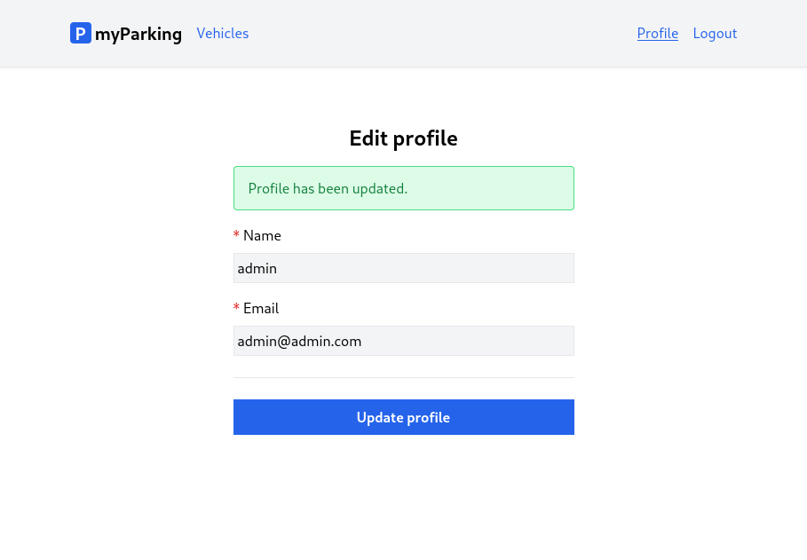

# Lesson 9 - Edit profile page

Let's continue working on the client by implementing more useful features. In this lesson, we will cover how to create a user profile form to update your name and email.



## Profile store

Create a new `src/stores/profile.js` store.

```js
import { reactive, ref } from "vue";
import { defineStore } from "pinia";

export const useProfile = defineStore("profile", () => {
  const errors = reactive({});
  const status = ref("");
  const loading = ref(false);
  const form = reactive({
    name: "",
    email: "",
  });

  function resetForm() {
    form.name = "";
    form.email = "";

    errors.value = {};
    status.value = "";
  }

  async function fetchProfile() {
    return window.axios.get("profile").then((response) => {
      form.name = response.data.name;
      form.email = response.data.email;
    });
  }

  async function updateProfile() {
    loading.value = true;
    errors.value = {};
    status.value = "";

    return window.axios
      .put("profile", form)
      .then((response) => {
        form.name = response.data.name;
        form.email = response.data.email;
        status.value = "Profile has been updated.";
      })
      .catch((error) => {
        if (error.response.status === 422) {
          errors.value = error.response.data.errors;
        }
      })
      .finally(() => {
        loading.value = false;
      });
  }

  return {
    form,
    loading,
    errors,
    resetForm,
    status,
    fetchProfile,
    updateProfile,
  };
});
```

We have some new things this time.

The store has an additional `status` variable, it will be used to display a success message that the request to update profile data was successful.

```js
const status = ref("");
```

Up to this moment, the only thing client knows about the user is whether it is authorized or not. Method `fetchProfile()` allows fetching user name and email from API.

```js
async function fetchProfile() {
  return window.axios.get("profile").then((response) => {
    form.name = response.data.name;
    form.email = response.data.email;
  });
}
```

## Form to edit profile

Create a new `src/views/Profile/EditView.vue` component.

```vue
<script setup>
import { onMounted, onBeforeUnmount } from "vue";
import { useProfile } from "@/stores/profile";

const store = useProfile();

onMounted(store.fetchProfile);
onBeforeUnmount(store.resetForm);
</script>

<template>
  <form @submit.prevent="store.updateProfile">
    <div class="flex flex-col mx-auto md:w-96 w-full">
      <h1 class="text-2xl font-bold mb-4 text-center">Edit profile</h1>
      <div class="alert alert-success mb-4" v-show="store.status">
        {{ store.status }}
      </div>
      <div class="flex flex-col gap-2 mb-4">
        <label for="name" class="required">Name</label>
        <input
          type="text"
          name="name"
          id="name"
          class="form-input"
          v-model="store.form.name"
          :disabled="store.loading"
        />
        <ValidationError :errors="store.errors" field="name" />
      </div>
      <div class="flex flex-col gap-2">
        <label for="email" class="required">Email</label>
        <input
          type="email"
          name="email"
          id="email"
          class="form-input"
          v-model="store.form.email"
          :disabled="store.loading"
        />
        <ValidationError :errors="store.errors" field="email" />
      </div>

      <div class="border-t h-[1px] my-6"></div>

      <button type="submit" class="btn btn-primary" :disabled="store.loading">
        <IconSpinner class="animate-spin" v-show="store.loading" />
        Update profile
      </button>
    </div>
  </form>
</template>
```

Right in the beginning we can see the imported `onMounted()` hook. This lifecycle hook registers a callback to be called after the component has been mounted. This hook is typically used for performing side effects. One of the side effects we want is to fetch profile data from API. `fetchProfile()` function from the profile store is passed as mentioned callback.

```js
onMounted(store.fetchProfile);
```

At the top of the form, we have a small snippet to display the success message.

```vue
<div class="alert alert-success mb-4" v-show="store.status">
  {{ store.status }}
</div>
```

Since we do not have any alert classes by default, to display that in green color add them to `src/assets/main.css`:

```css
.alert {
    @apply border px-4 py-3 rounded relative;
}

.alert-success {
    @apply text-green-700 bg-green-100 border-green-400
}
```

Register the newly created component in the `src/router/index.js` file:

```js
{
  path: "/profile",
  name: "profile.edit",
  beforeEnter: auth,
  component: () => import("@/views/Profile/EditView.vue"),
},
```

## Navigation

And finally, add the router link to the main layout in the `src/App.vue` component right before the `Logout` button.

```vue
<template v-if="auth.check">
  <RouterLink class="router-link" :to="{ name: 'profile.edit' }">
    Profile
  </RouterLink>
  <button @click="auth.logout" class="router-link">Logout</button>
</template>
```

Full updated `src/App.vue` components now should like this:

```vue
<script setup>
import { RouterLink, RouterView } from "vue-router";
import { useAuth } from "@/stores/auth";

const auth = useAuth();
</script>

<template>
  <header class="py-6 bg-gray-100 shadow">
    <div class="container md:px-2 px-4 mx-auto">
      <nav class="flex gap-4 justify-between">
        <div class="flex gap-4 items-center">
          <h2 class="text-xl font-bold">
            <div
              class="inline-flex items-center justify-center bg-blue-600 w-6 h-6 text-center text-white rounded"
            >
              P
            </div>
            myParking
          </h2>

          <template v-if="auth.check">
            <RouterLink class="router-link" :to="{ name: 'vehicles.index' }">
              Vehicles
            </RouterLink>
          </template>
          <template v-else>
            <RouterLink class="router-link" :to="{ name: 'home' }">
              Home
            </RouterLink>
          </template>
        </div>
        <div class="flex gap-4 items-center">
          <template v-if="auth.check">
            <RouterLink class="router-link" :to="{ name: 'profile.edit' }">
              Profile
            </RouterLink>
            <button @click="auth.logout" class="router-link">Logout</button>
          </template>
          <template v-else>
            <RouterLink class="router-link" :to="{ name: 'login' }">
              Login
            </RouterLink>
            <RouterLink class="router-link" :to="{ name: 'register' }">
              Register
            </RouterLink>
          </template>
        </div>
      </nav>
    </div>
  </header>

  <div class="container md:px-2 px-4 pt-8 md:pt-16 mx-auto">
    <RouterView />
  </div>
</template>
```

Now navigate to the `/profile` URL and try to update user data with various data.